<!-- markdownlint-disable MD041 MD033 -->
<p align="center">
  
</p>

<h1 align="center">a2a-orchestrator</h1>

<p align="center">
  <strong>Agent-to-Agent routing MCP server</strong><br>
  <em>Route tasks between AI agents with loop, budget, and signature controls</em>
</p>

<p align="center">
  <a href="https://www.python.org/"></a>
  <a href="LICENSE"></a>
  <a href="CHANGELOG.md"></a>
  <a href="tests/"></a>
  <a href="https://docs.astral.sh/ruff/"></a>
</p>

<p align="center">
  <strong>🇬🇧 English</strong> · <a href="README.ru.md">🇷🇺 Русский</a>
</p>

<p align="center">
  <a href="docs/en/getting-started.md">Quick Start</a> ·
  <a href="docs/en/tools-reference.md">Tools</a> ·
  <a href="docs/en/architecture.md">Architecture</a> ·
  <a href="docs/en/configuration.md">Configuration</a> ·
  <a href="CHANGELOG.md">Changelog</a>
</p>

---

## Why?

In a typical multi-agent setup, when Agent A delegates to Agent B it
forwards the entire conversation transcript — costing **30–45×** the
tokens of a structured message. `a2a-cli` replaces transcript
forwarding with a structured handoff message and enforces security
boundaries (whitelist, loop prevention, depth/budget caps, signature
verification, destructive-action consent).

## Key features

| Feature | Detail |
| --- | --- |
| **11 MCP tools** | `send_a2a`, `create_saga`, `load_context`, `get_chain_status`, `get_metrics`, `get_saga_status`, `search_messages`, registration, `list_tenants` |
| **6 routing rules (R1–R6)** | Whitelist, loop, depth, budget, signature, destructive consent |
| **Saga pattern** | Multi-chain dialog state, per-saga budget of 6 calls |
| **Signed messages** | Ed25519 signatures, canonical JSON, R6 verification |
| **WebSocket streaming** | Real-time event broadcast on port 8788 |
| **REST API** | FastAPI wrapper on port 8789, 12 endpoints |
| **Multi-tenant** | Per-tenant isolation, `TenantManager` |
| **External agents** | Challenge-response registration with Ed25519 |
| **Search** | TF-style scoring with Mnemos→JSONL fallback |
| **241 tests** | Unit + e2e, all passing |

## Quick start

**One-liner install** (creates a venv, installs from GitHub, optionally
registers in VS Code `mcp.json`):

```bash
curl -fsSL https://raw.githubusercontent.com/Korrnals/a2a-orchestrator/main/scripts/install.sh | bash
```

**Manual install** (development checkout):

```bash
git clone https://github.com/Korrnals/a2a-orchestrator.git
cd a2a-cli
pip install -e .
# Add to VS Code mcp.json — see docs/en/getting-started.md
python3 -m a2a_orchestrator
```

<details>
<summary>Install options</summary>

```bash
# Specific version
curl -fsSL https://raw.githubusercontent.com/Korrnals/a2a-orchestrator/main/scripts/install.sh | bash -s -- --version 1.0.0

# Auto-setup MCP integration (no prompt)
curl -fsSL https://raw.githubusercontent.com/Korrnals/a2a-orchestrator/main/scripts/install.sh | bash -s -- --mcp

# No venv (install into system Python)
curl -fsSL https://raw.githubusercontent.com/Korrnals/a2a-orchestrator/main/scripts/install.sh | bash -s -- --no-venv

# Custom venv path + use uv
curl -fsSL https://raw.githubusercontent.com/Korrnals/a2a-orchestrator/main/scripts/install.sh | bash -s -- --venv ~/.my-venv --uv
```

The install script:

- Creates a venv at `~/.a2a-orchestrator/venv`
- Installs the package from GitHub
- Creates a launcher in `~/.local/bin/a2a-orchestrator`
- Optionally registers in VS Code `mcp.json`

</details>

## Uninstall

```bash
curl -fsSL https://raw.githubusercontent.com/Korrnals/a2a-orchestrator/main/scripts/uninstall.sh | bash
```

Removes the venv, the launcher, and the `mcp.json` entry.

## Documentation

- [Getting Started](docs/en/getting-started.md)
- [Tools Reference](docs/en/tools-reference.md)
- [Architecture](docs/en/architecture.md)
- [Routing Rules (R1–R6)](docs/en/routing-rules.md)
- [Configuration](docs/en/configuration.md)
- [CLI Reference](docs/en/cli-reference.md)
- [REST API](docs/en/rest-api.md)
- [Security](docs/en/security.md)
- [Testing](docs/en/testing.md)

Full documentation index: [docs/](docs/README.md)

## License

[MIT](LICENSE) — © 2026 a2a-cli contributors.
