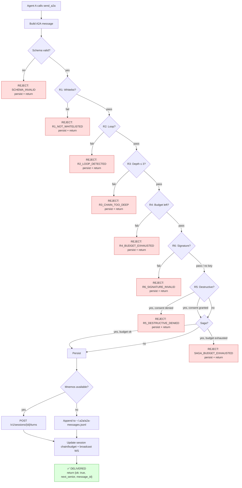
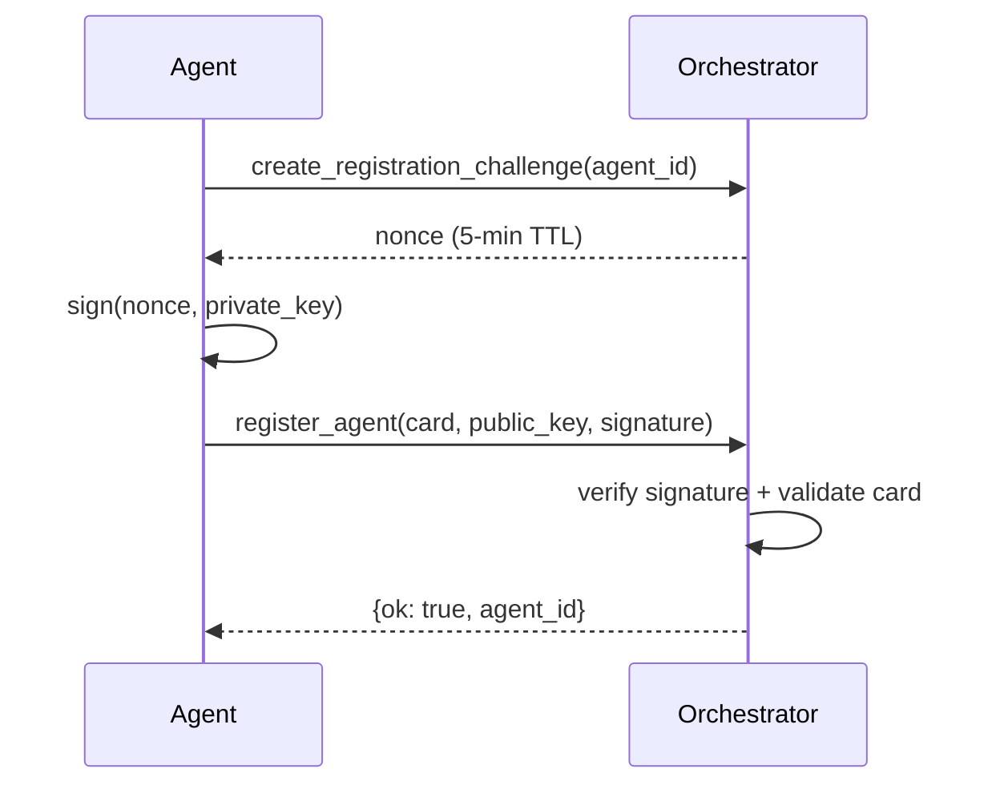
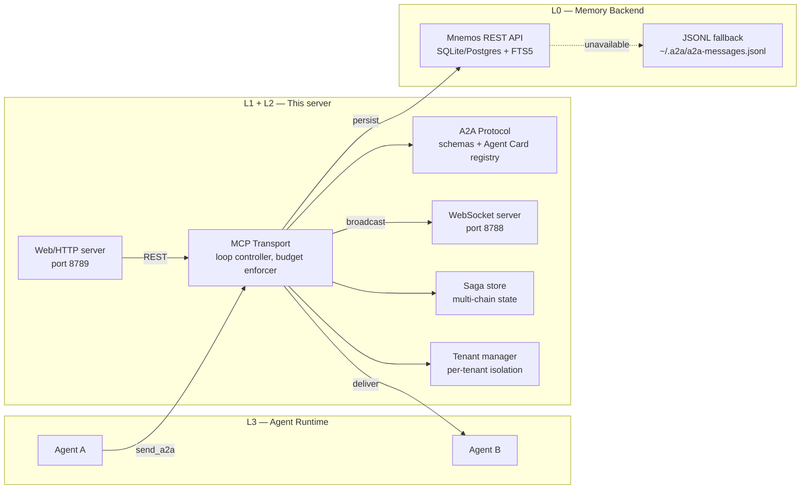

# a2a-orchestrator

[](https://www.python.org/)
[](LICENSE)
[](CHANGELOG.md)
[](tests/)
[](https://docs.astral.sh/ruff/)

A standalone **MCP (Model Context Protocol) server** that implements
**A2A (Agent-to-Agent) routing** for multi-agent systems. It lets AI agents
hand tasks to each other without transferring the full chat history —
saving roughly **30–45× tokens per handoff**.

The server exposes **10 MCP tools**, runs **six routing checks (R1–R6)**,
persists every message to [Mnemos] or a local JSONL fallback, tracks
per-session chain depth and call budget, supports **sagas** for
long-lived multi-chain dialogs, **signed messages** (Ed25519),
**WebSocket streaming**, **vector/substring search**, a **FastAPI REST
wrapper**, **external agent registration**, and **multi-tenant
isolation**.

> **Universal tool.** Although `a2a-orchestrator` originated inside the
> [GCW] project, it is a general-purpose A2A router. Any multi-agent
> system that speaks the A2A wire format can use it — no GCW dependency
> required. Schemas are embedded in the package itself.

---

## Table of contents

- [Why A2A routing?](#why-a2a-routing)
- [Key features](#key-features)
- [Quick start](#quick-start)
- [Configuration](#configuration)
- [MCP tools](#mcp-tools)
- [Routing rules (R1–R6)](#routing-rules-r1r6)
- [Saga pattern](#saga-pattern)
- [Signed messages (R6)](#signed-messages-r6)
- [WebSocket streaming](#websocket-streaming)
- [Search](#search)
- [Web / HTTP API](#web--http-api)
- [External agent registration](#external-agent-registration)
- [Multi-tenant](#multi-tenant)
- [Architecture](#architecture)
- [A2A message format](#a2a-message-format)
- [Agent Card format](#agent-card-format)
- [Persistence and fallback](#persistence-and-fallback)
- [CLI](#cli)
- [Roadmap](#roadmap)
- [Development](#development)
- [Contributing](#contributing)
- [License](#license)
- [Links](#links)

---

## Why A2A routing?

In a typical multi-agent setup, when Agent A delegates to Agent B it
forwards the entire conversation transcript. At 150 K+ tokens per
context window, a single handoff can cost 30–45× the tokens of a
structured message that contains only what B needs.

A2A routing solves this by replacing transcript forwarding with a
**structured handoff message**: a summary, key decisions, open
questions, and a pointer to artifacts. The orchestrator enforces
security boundaries (whitelist, loop prevention, depth/budget caps,
signature verification, destructive-action consent) so agents can't
accidentally call each other in circles or escalate beyond their
authority.

| Approach | Tokens per handoff | Loop-safe? | Auditable? |
| --- | --- | --- | --- |
| Full transcript forward | ~150 K | ❌ no | ❌ no |
| A2A structured message | ~3–5 K | ✅ yes | ✅ yes |

---

## Key features

- **10 MCP tools** — `send_a2a`, `load_context`, `get_chain_status`,
  `get_metrics`, `get_saga_status`, `search_messages`,
  `create_registration_challenge`, `register_agent`, `unregister_agent`,
  `list_tenants` (see [MCP tools](#mcp-tools)).
- **6 routing rules (R1–R6)** — whitelist, loop, depth, budget,
  signature verification, destructive-action consent
  (see [Routing rules](#routing-rules-r1r6)).
- **Saga pattern** — long-lived dialog state across multiple A2A
  chains, per-saga budget of 6 calls
  (see [Saga pattern](#saga-pattern)).
- **Signed messages** — Ed25519 signatures, canonical JSON, R6
  verification, runtime KeyStore
  (see [Signed messages](#signed-messages-r6)).
- **WebSocket streaming** — real-time event broadcast on port 8788
  (see [WebSocket streaming](#websocket-streaming)).
- **Vector/substring search** — `search_messages` tool with
  Mnemos→JSONL fallback (see [Search](#search)).
- **Web/HTTP wrapper** — FastAPI REST API on port 8789, 12 endpoints
  (see [Web / HTTP API](#web--http-api)).
- **External agent registration** — challenge-response flow with
  Ed25519 (see [External agent registration](#external-agent-registration)).
- **Multi-tenant** — per-tenant isolation, `TenantManager`, default
  tenant for backward compat (see [Multi-tenant](#multi-tenant)).
- **Agent Card registry** — loads `a2a/agents/*.json`, builds a
  forward-index whitelist for O(1) R1 lookups.
- **Per-session state** — chain, depth, and budget tracking with
  LRU eviction (256 sessions, thread-safe).
- **Mnemos REST client** — persists A2A messages to [Mnemos] with
  retry/backoff across 5 endpoints.
- **JSONL file fallback** — if Mnemos is unavailable, messages are
  written to `~/.a2a/a2a-messages.jsonl`. The orchestrator works
  without Mnemos.
- **Embedded schemas** — JSON schemas ship inside the package
  (`a2a_orchestrator/schemas/`); no external schema directory required.
- **191 tests** — unit + e2e, all passing.

---

## Quick start

```bash
# Clone
git clone https://github.com/Korrnals/a2a-orchestrator.git
cd a2a-orchestrator

# Install (editable)
pip install -e .

# Optional: install web server dependencies
pip install -e ".[web]"

# Configure (optional — schemas are embedded; cards auto-detected)
export A2A_CARDS_DIR=/path/to/agent/cards
export MNEMOS_BASE_URL=http://127.0.0.1:8787

# Run as an MCP server (stdio transport)
python3 -m a2a_orchestrator
```

### Register in VS Code

Add the server to your `mcp.json`:

```json
{
  "servers": {
    "a2a-orchestrator": {
      "command": "python3",
      "args": ["-m", "a2a_orchestrator"],
      "env": {
        "A2A_CARDS_DIR": "/path/to/agent/cards",
        "MNEMOS_BASE_URL": "http://127.0.0.1:8787"
      }
    }
  }
}
```

After editing, reload the window
(**Ctrl+Shift+P → Developer: Reload Window**) so the MCP host re-reads
the config.

---

## Configuration

All settings are environment variables. The `A2A_*` names are primary;
the old `GCW_*` names are accepted as backward-compat fallbacks.

| Env var | Legacy fallback | Default | Purpose |
| --- | --- | --- | --- |
| `A2A_CARDS_DIR` | `GCW_CARDS_DIR` | auto-detect | Directory with Agent Card JSON files (`a2a/agents/*.json`) |
| `A2A_SCHEMA_DIR` | `GCW_SCHEMA_DIR` | embedded | Directory containing `agent-card.schema.json` and `a2a-message.schema.json` |
| `A2A_FALLBACK_JSONL` | `GCW_A2A_FALLBACK_JSONL` | `~/.a2a/a2a-messages.jsonl` | JSONL fallback file path |
| `MNEMOS_BASE_URL` | — | `http://127.0.0.1:8787` | Mnemos REST API base URL |
| `A2A_ORCHESTRATOR_LOG_LEVEL` | `GCW_ORCHESTRATOR_LOG_LEVEL` | `INFO` | Logging level (`DEBUG`, `INFO`, `WARNING`, …) |
| `A2A_WS_PORT` | — | `8788` | WebSocket server port |
| `A2A_WEB_CORS_ORIGINS` | — | `http://localhost,http://127.0.0.1` | Comma-separated CORS origins for the web server |
| `A2A_WEB_API_KEY` | — | *(unset = no auth)* | API key for web server (`X-API-Key` header) |

**Auto-detect order** for `A2A_CARDS_DIR`:

1. The env var itself, if set.
2. `a2a/agents` under any parent of the package directory (in-tree dev).

**Schema resolution** for `A2A_SCHEMA_DIR`:

1. The env var itself, if set.
2. Embedded schemas at `a2a_orchestrator/schemas/` (default — no
   external directory needed).
3. `docs/a2a/schemas/` under any parent of the package directory (last
   resort for in-tree dev checkouts).

In production, always set `A2A_CARDS_DIR` explicitly — don't rely on
auto-detection.

---

## MCP tools

The server exposes ten MCP tools. Agents call them to route messages,
load context, inspect state, search, and manage tenants and external
agents.

### `send_a2a`

Route a structured A2A message from one agent to another. Runs R1–R6,
persists the message, updates session chain/budget, optionally tracks
saga state, and broadcasts a WebSocket event.

```python
send_a2a(
    target: str,               # A2A id of the receiving agent
    reason: str,               # 10–500 chars — why the handoff
    summary: str,              # 20–2000 chars — what was done / found
    key_decisions: list[str] = [],       # decisions already made
    open_questions: list[str] = [],      # things the receiver must resolve
    artifacts: list[dict] = [],          # {kind, pointer} — files, diffs, memory
    intent: str = "handoff",             # see intent table below
    session_id: str = "",                # conversation id (auto-generated if empty)
    from_id: str = "",                   # A2A id of the calling agent
    saga_id: str = "",                   # optional saga id (saga must exist)
    signature: str = "",                 # base64 Ed25519 signature (R6)
    tenant_id: str = "default",          # tenant id for multi-tenant isolation
) -> dict
```

### Return value

| Field | Type | Present on | Description |
| --- | --- | --- | --- |
| `ok` | `bool` | always | `True` if delivered, `False` if rejected |
| `reason` | `str` | always | `"delivered"` or a human-readable rejection reason |
| `next_senior` | `str` | success | A2A id of the receiving agent |
| `message_id` | `str` | always | Unique id (`msg-<hex>`), even for rejected messages |
| `code` | `str` | rejection | Stable rejection code (e.g. `R1_NOT_WHITELISTED`) |

Rejected messages are **still persisted** (with `outcome: "rejected"`)
so the audit trail is complete.

### Intents

| Intent | When to use |
| --- | --- |
| `handoff` | Transfer ownership of the task (default) |
| `request-info` | Ask a question, keep ownership |
| `share-finding` | Report a result upstream |
| `request-review` | Ask for a review of work done |
| `request-implementation` | Ask another agent to implement |
| `request-documentation` | Ask another agent to write docs |
| `destructive-action-request` | Triggers R5 — requires user consent |

### Other tools

| Tool | Signature | Returns |
| --- | --- | --- |
| `load_context` | `(session_id, turn_id="", message_id="", mode="summary")` | The A2A message by turn_id or message_id |
| `get_chain_status` | `(session_id, tenant_id="default")` | Chain, depth, budget, recent messages |
| `get_metrics` | `(tenant_id="default")` | Counters: delivered, rejected, by-rule, writes, sessions |
| `get_saga_status` | `(saga_id, tenant_id="default")` | Saga state, chains, budget |
| `search_messages` | `(query, session_id="", limit=10, tenant_id="default")` | Ranked search results |
| `create_registration_challenge` | `(agent_id)` | Nonce to sign for external agent registration |
| `register_agent` | `(agent_card, public_key, challenge_signature)` | Registration result |
| `unregister_agent` | `(agent_id)` | Removal result |
| `list_tenants` | `()` | All tenants and their stats |

---

## Routing rules (R1–R6)

Every `send_a2a` call passes through six gates in order. The first
gate that rejects stops the handoff.

| Rule | Name | Check | Rejection code |
| --- | --- | --- | --- |
| **R1** | Whitelist | Target must be in the sender's `accepts_routes_from` | `R1_NOT_WHITELISTED` |
| **R2** | Loop | Target must not already be upstream in the chain | `R2_LOOP_DETECTED` |
| **R3** | Depth | Chain depth ≤ 3 (configurable per-agent via `max_chain_depth`) | `R3_CHAIN_TOO_DEEP` |
| **R4** | Budget | Max 3 A2A calls per conversation | `R4_BUDGET_EXHAUSTED` |
| **R6** | Signature | If sender's Agent Card has `public_key`, message must be signed | `R6_SIGNATURE_INVALID` |
| **R5** | Destructive | User consent required for `destructive-action-request` intent | `R5_DESTRUCTIVE_DENIED` |

> **Order note.** The code applies R1→R2→R3→R4 (pure routing gates)
> first, then R6 (signature), then R5 (destructive consent). R5 is
> last because it may require interactive user consent.

### Routing pipeline



---

## Saga pattern

A **saga** groups multiple A2A chains that belong to the same logical
task. Without sagas, each A2A message starts a fresh chain with
`depth=0`; with sagas, a multi-step task (where agent B asks agent A a
clarifying question mid-chain) can persist state across chain
boundaries.

| Property | Value |
| --- | --- |
| Per-saga budget | 6 A2A calls (`SAGA_MAX_BUDGET = MAX_BUDGET × 2`) |
| States | `active`, `completed`, `abandoned` |
| LRU eviction | 128 sagas in memory |
| Thread-safe | yes (single `threading.Lock`) |

A saga is created programmatically via `SagaStore.create_saga()` and
referenced by `saga_id` in `send_a2a`. When `saga_id` is provided, the
chain is tracked within the saga and the per-saga budget is enforced
in addition to the per-session budget.

```python
from a2a_orchestrator.server import saga_store

saga = saga_store.create_saga(root_session_id="conv-abc", metadata={"task": "migrate-orders"})
# saga.saga_id → "saga-<hex>"

# Later, in send_a2a:
send_a2a(target="agent-dba", ..., saga_id=saga.saga_id)
```

Inspect saga state with the `get_saga_status` MCP tool or the
`a2a-orchestrator saga status <id>` CLI command.

---

## Signed messages (R6)

When agents are distributed (not all in the same trusted workspace),
messages need cryptographic verification. Each agent has an Ed25519
keypair. Messages are signed by the sender; the orchestrator verifies
the signature against the sender's public key (from their Agent Card
or a runtime `KeyStore`).

**Backward compatibility:** if the sender's Agent Card has no
`public_key` field, signature verification is skipped entirely
(trust-by-construction, as before).

### How it works

1. The sender signs the **canonical JSON** of the message (sorted
   keys, no whitespace, UTF-8 preserved) with their Ed25519 private
   key.
2. The signature is passed as `signature` (base64) to `send_a2a`.
3. R6 checks the sender's `public_key` (Agent Card or KeyStore). If a
   key exists but the signature is missing or invalid, the message is
   rejected with `R6_SIGNATURE_INVALID`.

### Key sources

| Source | When |
| --- | --- |
| Agent Card `public_key` field | File-based agents loaded at startup |
| Runtime `KeyStore` | Externally-registered agents (see [Registration](#external-agent-registration)) |

---

## WebSocket streaming

The orchestrator can run a WebSocket server alongside the MCP stdio
server. Clients subscribe to session events and receive push
notifications when A2A messages are delivered, rejected, or chain
state changes.

| Property | Value |
| --- | --- |
| Default port | `8788` (`A2A_WS_PORT`) |
| Protocol | `ws://` (no TLS in the default config) |
| Optional | If `websockets` is not installed, degrades silently to no-push |

### Event types

| Event | When |
| --- | --- |
| `a2a_delivered` | An A2A message was successfully routed |
| `a2a_rejected` | An A2A message was rejected (R1–R6) |
| `chain_updated` | A session's chain/budget state changed |
| `saga_completed` | A saga was marked as completed |
| `saga_abandoned` | A saga was abandoned |

### Start with WebSocket

```bash
# MCP + WebSocket
a2a-orchestrator serve --ws

# MCP + WebSocket + Web server
a2a-orchestrator serve --all

# Monitor events for a session
a2a-orchestrator ws-monitor --session-id conv-abc
```

---

## Search

The `search_messages` tool searches A2A message content for relevant
past conversations. It uses Mnemos's search API when available; falls
back to substring search on the JSONL fallback file when Mnemos is
unreachable.

| Property | Value |
| --- | --- |
| Matching | TF-style substring scoring on summary, reason, key_decisions, open_questions |
| Scope | Session-scoped (`session_id` provided) or global |
| Ranking | Score descending; top `limit` results |
| Fallback | JSONL `MessageStore.load_all()` when Mnemos is down |

```python
search_messages(query="orders migration", session_id="conv-abc", limit=5)
# → {ok: true, results: [{message, score, session_id, message_id}, ...], count: N}
```

---

## Web / HTTP API

A FastAPI REST wrapper mirrors the MCP tools over HTTP, so non-VS Code
runtimes (CLI, web apps, external services) can use the orchestrator.

| Property | Value |
| --- | --- |
| Default port | `8789` |
| Dependencies | `pip install -e ".[web]"` (fastapi + uvicorn) |
| CORS | `A2A_WEB_CORS_ORIGINS` (comma-separated) |
| Auth | `A2A_WEB_API_KEY` (`X-API-Key` header; unset = no auth) |

### REST endpoints

| Method | Path | Maps to |
| --- | --- | --- |
| `GET` | `/health` | Health check |
| `POST` | `/v1/send` | `send_a2a` |
| `GET` | `/v1/context/{session_id}/{turn_id}` | `load_context` |
| `GET` | `/v1/chain/{session_id}` | `get_chain_status` |
| `GET` | `/v1/metrics` | `get_metrics` |
| `GET` | `/v1/saga/{saga_id}` | `get_saga_status` |
| `POST` | `/v1/search` | `search_messages` |
| `GET` | `/v1/agents` | List registered agents |
| `POST` | `/v1/register/challenge` | `create_registration_challenge` |
| `POST` | `/v1/register` | `register_agent` |
| `DELETE` | `/v1/register/{agent_id}` | `unregister_agent` |
| `GET` | `/v1/tenants` | `list_tenants` |

### Start the web server

```bash
# Standalone web server
a2a-orchestrator web --host 127.0.0.1 --port 8789

# Or alongside MCP + WS
a2a-orchestrator serve --all
```

### Example: send via REST

```bash
curl -X POST http://127.0.0.1:8789/v1/send \
  -H "Content-Type: application/json" \
  -d '{
    "target": "agent-dba",
    "from_id": "agent-tech-lead",
    "reason": "Task requires database expertise",
    "summary": "User needs a migration for the orders table"
  }'
```

---

## External agent registration

Agents outside the workspace can register at runtime by submitting
their Agent Card + public key, proving ownership of the corresponding
private key via a challenge-response signature.

### Flow



1. Agent calls `create_registration_challenge(agent_id)` → orchestrator
   generates a nonce, stores it with a 5-minute TTL.
2. Agent signs the nonce with their Ed25519 private key.
3. Agent calls `register_agent(agent_card, public_key,
   challenge_signature)`.
4. Orchestrator verifies the signature against the nonce, validates
   the Agent Card, and adds the card + key to the runtime registry +
   KeyStore.

Remove an externally-registered agent with `unregister_agent(agent_id)`.

---

## Multi-tenant

The orchestrator supports per-tenant isolation. Each tenant has its
own Agent Card registry, session store, message store, metrics, saga
store, and key store.

| Property | Value |
| --- | --- |
| Default tenant | `"default"` (backward compat — all calls without `tenant_id` use it) |
| Isolation | Full: registry, sessions, metrics, sagas, keys |
| Management | `TenantManager` creates and caches `TenantContext` on demand |
| Cards directory | Default tenant uses `A2A_CARDS_DIR`; other tenants use `cards_dir / tenant_id` |

Use the `tenant_id` parameter on `send_a2a`, `get_chain_status`,
`get_metrics`, `get_saga_status`, and `search_messages` to scope
operations to a tenant. `get_metrics(tenant_id="all")` returns
metrics for all tenants.

List all tenants with the `list_tenants` MCP tool or
`a2a-orchestrator tenants list` CLI command.

---

## Architecture

The system has four layers. `a2a-orchestrator` implements **L1** and
**L2**; L0 and L3 are external.



| Layer | Responsibility | Implemented by |
| --- | --- | --- |
| **L0** Memory backend | Durable storage, full-text search | [Mnemos] (external) |
| **L1** MCP transport | Loop controller, budget enforcer, logger, WS, web | **this server** |
| **L2** A2A protocol | JSON schemas, Agent Card registry, routing rules, sagas, signing, tenants | **this server** |
| **L3** Agent runtime | Agents that call `send_a2a` | your agents |

### Module layout

| Module | Role |
| --- | --- |
| `server.py` | FastMCP entry point, 10 MCP tools, persistence wiring |
| `routing.py` | R1–R4 gates + R6 signature check (pure functions, no I/O) |
| `destructive.py` | R5 consent provider |
| `registry.py` | Agent Card loader + whitelist forward index |
| `session.py` | Per-session chain/depth/budget state (LRU, thread-safe) |
| `validation.py` | JSON-schema validation for cards and messages |
| `mnemos_client.py` | Mnemos REST client with retry/backoff |
| `persistence.py` | In-memory + JSONL message store |
| `config.py` | Environment-based configuration + auto-detect |
| `saga.py` | Saga pattern — multi-chain dialog state, per-saga budget |
| `signing.py` | Ed25519 signed messages, canonical JSON, KeyStore |
| `search.py` | Vector/substring search with Mnemos→JSONL fallback |
| `ws_server.py` | WebSocket server for real-time event broadcast |
| `web_server.py` | FastAPI REST wrapper (optional `[web]` dependency) |
| `registration.py` | External agent registration with challenge-response |
| `tenant.py` | Multi-tenant isolation, TenantManager, TenantContext |
| `metrics.py` | Thread-safe counters for observability |
| `cli.py` | CLI wrapper (12 commands) |

---

## A2A message format

Every `send_a2a` call produces a message in this wire format (schema
version `0.7.0`):

```json
{
  "schema_version": "0.7.0",
  "message_id": "msg-a1b2c3d4e5f6",
  "session_id": "conv-7a8b9c0d1e2f",
  "from": "agent-tech-lead",
  "to": "agent-dba",
  "intent": "handoff",
  "reason": "Task requires database expertise",
  "signature": "base64-ed25519-signature",
  "tenant_id": "default",
  "payload": {
    "summary": "User needs a migration for the orders table",
    "key_decisions": ["add column, not a new table"],
    "open_questions": ["should the new column be indexed?"],
    "artifacts": [
      {"kind": "file", "pointer": "src/models/orders.py"}
    ]
  },
  "routing_meta": {
    "chain": ["agent-tech-lead"],
    "depth": 0,
    "calls_remaining": 3,
    "parent_message_id": null,
    "saga_id": "saga-1a2b3c4d5e6f"
  }
}
```

| Field | Required | Description |
| --- | --- | --- |
| `schema_version` | yes | Pinned to `"0.7.0"` |
| `message_id` | yes | Unique id (`msg-<hex>`) |
| `session_id` | yes | Mnemos session id |
| `from` / `to` | yes | A2A ids (lowercase kebab-case) |
| `intent` | yes | One of the 7 intents (see above) |
| `payload` | yes | `summary` (required) + `key_decisions`, `open_questions`, `artifacts` |
| `routing_meta` | yes | `chain`, `depth`, `calls_remaining` (required) + `parent_message_id`, `saga_id` |
| `signature` | no | Base64 Ed25519 signature — required when sender has `public_key` (R6) |
| `tenant_id` | no | Tenant id — defaults to `"default"` when omitted |

---

## Agent Card format

Each agent declares an **Agent Card** — a JSON file in
`A2A_CARDS_DIR` that describes its identity, capabilities, and routing
rules.

```json
{
  "id": "agent-dba",
  "name": "Database Agent",
  "version": "1.0.0",
  "plugin": "my-project",
  "agent_file": "dba.agent.md",
  "capabilities": ["schema-design", "migration-review"],
  "routing": {
    "accepts_routes_from": ["agent-tech-lead", "agent-backend"],
    "routing_keywords": ["database", "sql", "migration"]
  },
  "tags": ["postgres", "mysql"],
  "max_chain_depth": 3,
  "public_key": "base64-ed25519-public-key",
  "tenant_id": "default"
}
```

| Field | Required | Description |
| --- | --- | --- |
| `id` | yes | Unique A2A id (used in `from` / `to` / `target`) |
| `name` | yes | Human-readable display name |
| `version` | yes | Card version (semver) |
| `plugin` | yes | Owning plugin or namespace |
| `agent_file` | yes | Path to the agent definition file |
| `capabilities` | yes | What the agent can do (kebab-case strings) |
| `routing.accepts_routes_from` | yes | Senders allowed to route to this agent (R1 whitelist) |
| `routing.routing_keywords` | yes | Keywords that suggest this agent (advisory) |
| `tags` | no | Free-form tags for filtering |
| `max_chain_depth` | no | Override global max chain depth (default 3, range 1–5) |
| `public_key` | no | Base64 Ed25519 public key — enables R6 signature verification |
| `tenant_id` | no | Tenant id — defaults to `"default"` when omitted |

The registry builds a **forward index** from `accepts_routes_from` so
R1 checks are O(1).

---

## Persistence and fallback

Every message — delivered or rejected — is persisted for audit. The
server tries Mnemos first; if Mnemos is unavailable, it falls back to
a local JSONL file.

```
agent A → send_a2a → a2a-orchestrator
                        ├─[Mnemos OK]→ POST /v1/sessions/{id}/turns → 201 → deliver
                        └─[Mnemos DOWN]→ ~/.a2a/a2a-messages.jsonl → deliver
```

**Mnemos is not a single point of failure.** The orchestrator works
without it — messages are always written to the JSONL store first, then
mirrored to Mnemos. If the Mnemos write fails, the JSONL copy is the
durable fallback.

---

## CLI

The `a2a-orchestrator` CLI wraps the same internal functions as the
MCP tools. Useful for scripting, debugging, and smoke-testing without
an MCP client.

```bash
# Send a message
a2a-orchestrator send --from agent-a --to agent-b \
  --reason "..." --summary "..." --session-id conv-001

# List recent messages for a session
a2a-orchestrator list --session-id conv-001 --limit 10

# Chain status
a2a-orchestrator status --session-id conv-001

# List registered agents
a2a-orchestrator agents

# Metrics counters
a2a-orchestrator metrics

# Start the MCP server (same as python3 -m a2a_orchestrator)
a2a-orchestrator serve

# Start MCP + WebSocket
a2a-orchestrator serve --ws

# Start MCP + WebSocket + Web server
a2a-orchestrator serve --all --web-host 127.0.0.1 --web-port 8789

# Start the web/HTTP server only
a2a-orchestrator web --host 127.0.0.1 --port 8789

# Monitor WebSocket events for a session
a2a-orchestrator ws-monitor --session-id conv-001

# Search messages
a2a-orchestrator search "orders migration" --limit 5

# Saga management
a2a-orchestrator saga list --status active
a2a-orchestrator saga status saga-abc123

# Register an external agent (two-step: challenge, then sign + submit)
a2a-orchestrator register --agent-card card.json --public-key key.b64
a2a-orchestrator register --agent-card card.json --public-key key.b64 --signature <sig>

# List tenants
a2a-orchestrator tenants list
```

| Command | Purpose |
| --- | --- |
| `send` | Send an A2A message |
| `list` | List recent messages for a session |
| `status` | Chain status for a session |
| `agents` | List registered agents |
| `metrics` | Metrics counters |
| `serve` | Start MCP server (`--ws`, `--all`) |
| `web` | Start web/HTTP server |
| `ws-monitor` | Monitor WebSocket events |
| `search` | Search A2A messages |
| `saga` | Saga management (`list`, `status`) |
| `register` | Register an external agent |
| `tenants` | Tenant management (`list`) |

---

## Roadmap

Completed features (see [CHANGELOG.md] for release history):

- [x] `send_a2a` tool with R1–R5 routing checks
- [x] `load_context` tool — read an A2A message by turn_id / message_id
- [x] `get_chain_status` tool — current depth / budget / chain
- [x] `get_metrics` tool — counters by routing rule, sessions
- [x] CLI wrapper — 12 commands for debugging without an MCP client
- [x] Metrics & observability — counters by routing rule, active/total sessions
- [x] Embedded schemas — no dependency on an external schema directory
- [x] Examples directory with minimal Agent Cards
- [x] Package rename `gcw_orchestrator` → `a2a_orchestrator`
- [x] Saga pattern — multi-chain dialog state, per-saga budget
- [x] Signed messages — Ed25519, R6, KeyStore
- [x] WebSocket streaming — real-time event broadcast
- [x] Vector/substring search — `search_messages` tool
- [x] Web/HTTP wrapper — FastAPI REST API, 12 endpoints
- [x] External agent registration — challenge-response with Ed25519
- [x] Multi-tenant isolation — TenantManager, per-tenant state

Planned:

- [ ] TLS for WebSocket and web server
- [ ] Saga completion / abandonment via MCP tool (currently internal API only)
- [ ] Per-tenant metrics in `list_tenants` output
- [ ] OpenTelemetry tracing export

---

## Development

```bash
# Install with dev dependencies
pip install -e ".[dev]"

# Lint
ruff check a2a_orchestrator/ tests/

# Type check
mypy a2a_orchestrator/ --ignore-missing-imports

# Run all tests
pytest tests/ -v

# Run e2e tests only
pytest tests/e2e/ -v
```

See [CONTRIBUTING.md] for the full workflow (branching, commit format,
pull requests).

---

## Contributing

Pull requests are welcome. The workflow is trunk-based with
short-lived feature branches:

1. Branch from `main`: `feat/...`, `fix/...`, `docs/...`.
2. All checks must pass: `ruff`, `mypy`, `pytest`.
3. At least one approving review is required.
4. Commit messages follow [Conventional Commits].

See [CONTRIBUTING.md] for details.

---

## License

[MIT](LICENSE) — © 2026 a2a-orchestrator contributors.

---

## Links

- [A2A Protocol Spec](https://github.com/Korrnals/a2a-orchestrator) — embedded in this repo
- [RFC-0001: A2A Routing Protocol](https://github.com/Korrnals/GithubCopilotWorkflow/blob/main/docs/rfcs/0001-a2a-routing.md) — original design RFC
- [Mnemos](https://github.com/Korrnals/mnemos) — memory backend (L0)
- [GCW](https://github.com/Korrnals/GithubCopilotWorkflow) — the project where A2A routing originated
- [CHANGELOG.md] — release history
- [CONTRIBUTING.md] — development setup and workflow

[Mnemos]: https://github.com/Korrnals/mnemos
[GCW]: https://github.com/Korrnals/GithubCopilotWorkflow
[CHANGELOG.md]: CHANGELOG.md
[CONTRIBUTING.md]: CONTRIBUTING.md
[Conventional Commits]: https://www.conventionalcommits.org/