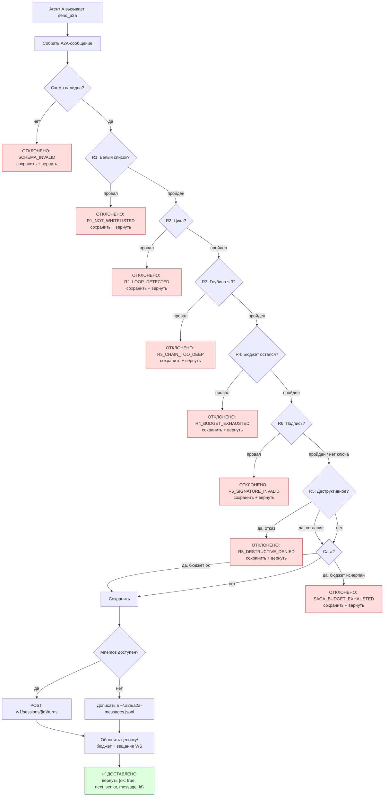
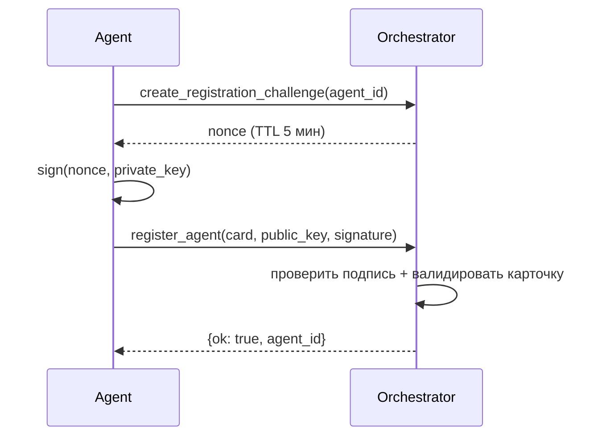
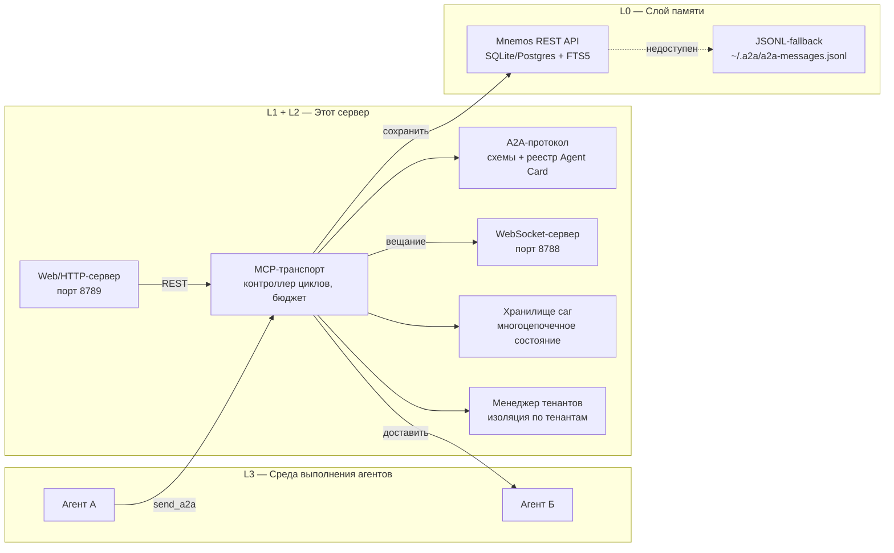

# a2a-orchestrator

[](https://www.python.org/)
[](LICENSE)
[](CHANGELOG.md)
[](tests/)
[](https://docs.astral.sh/ruff/)

Автономный **MCP-сервер (Model Context Protocol)**, реализующий
**A2A-маршрутизацию (Agent-to-Agent)** для мультиагентных систем. Позволяет
AI-агентам передавать задачи друг другу без пересылки полной истории
чата — экономия примерно **30–45× токенов на каждую передачу**.

Сервер предоставляет **10 MCP-инструментов**, выполняет **шесть проверок
маршрутизации (R1–R6)**, сохраняет каждое сообщение в [Mnemos] или
локальный JSONL-файл (fallback), отслеживает глубину цепочки и бюджет
вызовов для каждой сессии, поддерживает **саги** для долгоживущих
многоцепочечных диалогов, **подписанные сообщения** (Ed25519),
**WebSocket-стриминг**, **векторный/подстрочный поиск**, **FastAPI REST
обёртку**, **регистрацию внешних агентов** и **мультитенантную
изоляцию**.

> **Универсальный инструмент.** Хотя `a2a-orchestrator` зародился внутри
> проекта [GCW], это маршрутизатор A2A общего назначения. Любая
> мультиагентная система, говорящая на wire-формате A2A, может его
> использовать — привязка к GCW не требуется. Схемы встроены в сам пакет.

---

## Содержание

- [Зачем нужна A2A-маршрутизация?](#зачем-нужна-a2a-маршрутизация)
- [Ключевые возможности](#ключевые-возможности)
- [Быстрый старт](#быстрый-старт)
- [Конфигурация](#конфигурация)
- [MCP-инструменты](#mcp-инструменты)
- [Правила маршрутизации (R1–R6)](#правила-маршрутизации-r1r6)
- [Паттерн «сага»](#паттерн-сага)
- [Подписанные сообщения (R6)](#подписанные-сообщения-r6)
- [WebSocket-стриминг](#websocket-стриминг)
- [Поиск](#поиск)
- [Web / HTTP API](#web--http-api)
- [Регистрация внешних агентов](#регистрация-внешних-агентов)
- [Мультитенантность](#мультитенантность)
- [Архитектура](#архитектура)
- [Формат A2A-сообщения](#формат-a2a-сообщения)
- [Формат Agent Card](#формат-agent-card)
- [Сохранение и fallback](#сохранение-и-fallback)
- [CLI](#cli)
- [Дорожная карта](#дорожная-карта)
- [Разработка](#разработка)
- [Контрибьюшн](#контрибьюшн)
- [Лицензия](#лицензия)
- [Ссылки](#ссылки)

---

## Зачем нужна A2A-маршрутизация?

В типичной мультиагентной схеме, когда Агент А делегирует задачу Агенту Б,
он пересылает весь транскрипт разговора. При 150 K+ токенов в контекстном
окне одна передача может стоить в 30–45× больше токенов, чем
структурированное сообщение, содержащее только то, что нужно Б.

A2A-маршрутизация решает эту проблему: вместо пересылки транскрипта
отправляется **структурированное сообщение о передаче** — краткая сводка,
ключевые решения, открытые вопросы и указатель на артефакты. Оркестратор
контролирует границы безопасности (белый список, защита от циклов,
лимиты глубины и бюджета, проверка подписей, согласие на деструктивные
действия), поэтому агенты не могут случайно зациклиться друг на друге
или превысить свои полномочия.

| Подход | Токенов на передачу | Защита от циклов? | Аудируемо? |
| --- | --- | --- | --- |
| Пересылка полного транскрипта | ~150 K | ❌ нет | ❌ нет |
| Структурированное A2A-сообщение | ~3–5 K | ✅ да | ✅ да |

---

## Ключевые возможности

- **10 MCP-инструментов** — `send_a2a`, `load_context`, `get_chain_status`,
  `get_metrics`, `get_saga_status`, `search_messages`,
  `create_registration_challenge`, `register_agent`, `unregister_agent`,
  `list_tenants` (см. [MCP-инструменты](#mcp-инструменты)).
- **6 правил маршрутизации (R1–R6)** — белый список, защита от циклов,
  глубина, бюджет, проверка подписи, согласие на деструктивные действия
  (см. [Правила маршрутизации](#правила-маршрутизации-r1r6)).
- **Паттерн «сага»** — долгоживущее состояние диалога через несколько
  A2A-цепочек, бюджет 6 вызовов на сагу
  (см. [Паттерн «сага»](#паттерн-сага)).
- **Подписанные сообщения** — подписи Ed25519, канонический JSON,
  проверка R6, рантайм-хранилище ключей
  (см. [Подписанные сообщения](#подписанные-сообщения-r6)).
- **WebSocket-стриминг** — вещание событий в реальном времени на порту 8788
  (см. [WebSocket-стриминг](#websocket-стриминг)).
- **Векторный/подстрочный поиск** — инструмент `search_messages` с
  fallback Mnemos→JSONL (см. [Поиск](#поиск)).
- **Web/HTTP-обёртка** — REST API на FastAPI, порт 8789, 12 эндпоинтов
  (см. [Web / HTTP API](#web--http-api)).
- **Регистрация внешних агентов** — challenge-response через Ed25519
  (см. [Регистрация внешних агентов](#регистрация-внешних-агентов)).
- **Мультитенантность** — изоляция по тенантам, `TenantManager`, тенант
  по умолчанию для обратной совместимости
  (см. [Мультитенантность](#мультитенантность)).
- **Реестр Agent Card** — загружает `a2a/agents/*.json`, строит прямой
  индекс белого списка для O(1)-проверки R1.
- **Состояние сессии** — отслеживание цепочки, глубины и бюджета с
  LRU-вытеснением (256 сессий, потокобезопасно).
- **Mnemos REST-клиент** — сохраняет A2A-сообщения в [Mnemos] с
  повторными попытками и backoff через 5 эндпоинтов.
- **JSONL-fallback** — если Mnemos недоступен, сообщения пишутся в
  `~/.a2a/a2a-messages.jsonl`. Оркестратор работает без Mnemos.
- **Встроенные схемы** — JSON-схемы поставляются внутри пакета
  (`a2a_orchestrator/schemas/`); внешний каталог схем не нужен.
- **191 тест** — unit + e2e, все проходят.

---

## Быстрый старт

```bash
# Клонировать
git clone https://github.com/Korrnals/a2a-orchestrator.git
cd a2a-orchestrator

# Установить (editable)
pip install -e .

# Опционально: зависимости web-сервера
pip install -e ".[web]"

# Настроить (опционально — схемы встроены; карточки автоопределяются)
export A2A_CARDS_DIR=/path/to/agent/cards
export MNEMOS_BASE_URL=http://127.0.0.1:8787

# Запустить как MCP-сервер (транспорт stdio)
python3 -m a2a_orchestrator
```

### Регистрация в VS Code

Добавьте сервер в ваш `mcp.json`:

```json
{
  "servers": {
    "a2a-orchestrator": {
      "command": "python3",
      "args": ["-m", "a2a_orchestrator"],
      "env": {
        "A2A_CARDS_DIR": "/path/to/agent/cards",
        "MNEMOS_BASE_URL": "http://127.0.0.1:8787"
      }
    }
  }
}
```

После правки перезагрузите окно
(**Ctrl+Shift+P → Developer: Reload Window**), чтобы MCP-хост
перечитал конфигурацию.

---

## Конфигурация

Все настройки — переменные окружения. Имена `A2A_*` основные; старые
имена `GCW_*` принимаются как backward-compat fallback.

| Переменная | Legacy-fallback | По умолчанию | Назначение |
| --- | --- | --- | --- |
| `A2A_CARDS_DIR` | `GCW_CARDS_DIR` | автоопределение | Каталог с JSON-файлами Agent Card (`a2a/agents/*.json`) |
| `A2A_SCHEMA_DIR` | `GCW_SCHEMA_DIR` | встроенные | Каталог с `agent-card.schema.json` и `a2a-message.schema.json` |
| `A2A_FALLBACK_JSONL` | `GCW_A2A_FALLBACK_JSONL` | `~/.a2a/a2a-messages.jsonl` | Путь к JSONL-файлу fallback |
| `MNEMOS_BASE_URL` | — | `http://127.0.0.1:8787` | Базовый URL REST API Mnemos |
| `A2A_ORCHESTRATOR_LOG_LEVEL` | `GCW_ORCHESTRATOR_LOG_LEVEL` | `INFO` | Уровень логирования (`DEBUG`, `INFO`, `WARNING`, …) |
| `A2A_WS_PORT` | — | `8788` | Порт WebSocket-сервера |
| `A2A_WEB_CORS_ORIGINS` | — | `http://localhost,http://127.0.0.1` | CORS-origins для web-сервера (через запятую) |
| `A2A_WEB_API_KEY` | — | *(нет = без auth)* | API-ключ для web-сервера (заголовок `X-API-Key`) |

**Порядок автоопределения** для `A2A_CARDS_DIR`:

1. Сама переменная окружения, если задана.
2. `a2a/agents` под любым родителем каталога пакета (in-tree dev).

**Разрешение схем** для `A2A_SCHEMA_DIR`:

1. Сама переменная окружения, если задана.
2. Встроенные схемы в `a2a_orchestrator/schemas/` (по умолчанию —
   внешний каталог не нужен).
3. `docs/a2a/schemas/` под любым родителем каталога пакета (последнее
   средство для in-tree dev-чек autов).

В продакшене всегда задавайте `A2A_CARDS_DIR` явно — не полагайтесь на
автоопределение.

---

## MCP-инструменты

Сервер предоставляет десять MCP-инструментов. Агенты вызывают их для
маршрутизации сообщений, загрузки контекста, инспекции состояния,
поиска и управления тенантами и внешними агентами.

### `send_a2a`

Маршрутизирует структурированное A2A-сообщение от одного агента к
другому. Выполняет R1–R6, сохраняет сообщение, обновляет
цепочку/бюджет сессии, опционально отслеживает состояние саги и
вещает WebSocket-событие.

```python
send_a2a(
    target: str,               # A2A-id принимающего агента
    reason: str,               # 10–500 символов — зачем передача
    summary: str,              # 20–2000 символов — что сделано / найдено
    key_decisions: list[str] = [],       # уже принятые решения
    open_questions: list[str] = [],      # что нужно решить получателю
    artifacts: list[dict] = [],          # {kind, pointer} — файлы, диффы, память
    intent: str = "handoff",             # см. таблицу интентов ниже
    session_id: str = "",                # id разговора (автогенерация, если пусто)
    from_id: str = "",                   # A2A-id вызывающего агента
    saga_id: str = "",                   # опциональный id саги (сага должна существовать)
    signature: str = "",                 # base64 Ed25519-подпись (R6)
    tenant_id: str = "default",          # id тенанта для мультитенантной изоляции
) -> dict
```

### Возвращаемое значение

| Поле | Тип | Когда | Описание |
| --- | --- | --- | --- |
| `ok` | `bool` | всегда | `True` — доставлено, `False` — отклонено |
| `reason` | `str` | всегда | `"delivered"` или читаемая причина отклонения |
| `next_senior` | `str` | успех | A2A-id принимающего агента |
| `message_id` | `str` | всегда | Уникальный id (`msg-<hex>`), даже для отклонённых |
| `code` | `str` | отклонение | Стабильный код отклонения (например, `R1_NOT_WHITELISTED`) |

Отклонённые сообщения **всё равно сохраняются** (с `outcome: "rejected"`),
поэтому аудит-след остаётся полным.

### Интенты

| Интент | Когда использовать |
| --- | --- |
| `handoff` | Передать владение задачей (по умолчанию) |
| `request-info` | Задать вопрос, владение сохранить |
| `share-finding` | Сообщить результат вверх по цепочке |
| `request-review` | Запросить ревью выполненной работы |
| `request-implementation` | Попросить другого агента реализовать |
| `request-documentation` | Попросить другого агента написать документацию |
| `destructive-action-request` | Провоцирует R5 — требует согласия пользователя |

### Остальные инструменты

| Инструмент | Сигнатура | Возвращает |
| --- | --- | --- |
| `load_context` | `(session_id, turn_id="", message_id="", mode="summary")` | A2A-сообщение по turn_id или message_id |
| `get_chain_status` | `(session_id, tenant_id="default")` | Цепочку, глубину, бюджет, недавние сообщения |
| `get_metrics` | `(tenant_id="default")` | Счётчики: доставлено, отклонено, по-правилу, записи, сессии |
| `get_saga_status` | `(saga_id, tenant_id="default")` | Состояние саги, цепочки, бюджет |
| `search_messages` | `(query, session_id="", limit=10, tenant_id="default")` | Ранжированные результаты поиска |
| `create_registration_challenge` | `(agent_id)` | Nonce для подписи при регистрации внешнего агента |
| `register_agent` | `(agent_card, public_key, challenge_signature)` | Результат регистрации |
| `unregister_agent` | `(agent_id)` | Результат удаления |
| `list_tenants` | `()` | Все тенанты и их статистику |

---

## Правила маршрутизации (R1–R6)

Каждый вызов `send_a2a` проходит шесть ворот по порядку. Первый ворот,
который отклоняет, останавливает передачу.

| Правило | Название | Проверка | Код отклонения |
| --- | --- | --- | --- |
| **R1** | Белый список | Цель должна быть в `accepts_routes_from` отправителя | `R1_NOT_WHITELISTED` |
| **R2** | Цикл | Цель не должна уже быть выше по цепочке | `R2_LOOP_DETECTED` |
| **R3** | Глубина | Глубина цепочки ≤ 3 (настраивается через `max_chain_depth`) | `R3_CHAIN_TOO_DEEP` |
| **R4** | Бюджет | Максимум 3 A2A-вызова на разговор | `R4_BUDGET_EXHAUSTED` |
| **R6** | Подпись | Если в Agent Card отправителя есть `public_key`, сообщение должно быть подписано | `R6_SIGNATURE_INVALID` |
| **R5** | Деструктивное | Согласие пользователя для интента `destructive-action-request` | `R5_DESTRUCTIVE_DENIED` |

> **Порядок.** Код применяет R1→R2→R3→R4 (чистые routing-ворота)
> сначала, затем R6 (подпись), затем R5 (деструктивное согласие). R5
> последний, потому что может требовать интерактивного согласия
> пользователя.

### Конвейер маршрутизации



---

## Паттерн «сага»

**Сага** группирует несколько A2A-цепочек, принадлежащих одной
логической задаче. Без саг каждое A2A-сообщение начинает новую цепочку
с `depth=0`; с сагами многошаговая задача (где агент Б посреди цепочки
задаёт агенту А уточняющий вопрос) может сохранять состояние через
границы цепочек.

| Свойство | Значение |
| --- | --- |
| Бюджет на сагу | 6 A2A-вызовов (`SAGA_MAX_BUDGET = MAX_BUDGET × 2`) |
| Состояния | `active`, `completed`, `abandoned` |
| LRU-вытеснение | 128 саг в памяти |
| Потокобезопасно | да (один `threading.Lock`) |

Сага создаётся программно через `SagaStore.create_saga()` и
обращается по `saga_id` в `send_a2a`. Если передан `saga_id`, цепочка
отслеживается внутри саги, а бюджет саги учитывается дополнительно к
бюджету сессии.

```python
from a2a_orchestrator.server import saga_store

saga = saga_store.create_saga(root_session_id="conv-abc", metadata={"task": "migrate-orders"})
# saga.saga_id → "saga-<hex>"

# Позже в send_a2a:
send_a2a(target="agent-dba", ..., saga_id=saga.saga_id)
```

Инспектируйте состояние саги через MCP-инструмент `get_saga_status` или
CLI-команду `a2a-orchestrator saga status <id>`.

---

## Подписанные сообщения (R6)

Когда агенты распределены (не все в одном доверенном workspace),
сообщениям нужна криптографическая проверка. У каждого агента есть
ключевая пара Ed25519. Сообщения подписываются отправителем;
оркестратор проверяет подпись по открытому ключу отправителя (из его
Agent Card или рантайм-хранилища `KeyStore`).

**Обратная совместимость:** если в Agent Card отправителя нет поля
`public_key`, проверка подписи полностью пропускается
(trust-by-construction, как раньше).

### Как это работает

1. Отправитель подписывает **канонический JSON** сообщения
   (сортированные ключи, без лишних пробелов, UTF-8 сохранён) своим
   закрытым ключом Ed25519.
2. Подпись передаётся как `signature` (base64) в `send_a2a`.
3. R6 проверяет `public_key` отправителя (Agent Card или KeyStore).
   Если ключ есть, а подпись отсутствует или недействительна,
   сообщение отклоняется с `R6_SIGNATURE_INVALID`.

### Источники ключей

| Источник | Когда |
| --- | --- |
| Поле `public_key` в Agent Card | Файловые агенты, загруженные при старте |
| Рантайм-`KeyStore` | Внешние зарегистрированные агенты (см. [Регистрация](#регистрация-внешних-агентов)) |

---

## WebSocket-стриминг

Оркестратор может запускать WebSocket-сервер параллельно с MCP-сервером
stdio. Клиенты подписываются на события сессии и получают push-уведомления,
когда A2A-сообщения доставляются, отклоняются или состояние цепочки
меняется.

| Свойство | Значение |
| --- | --- |
| Порт по умолчанию | `8788` (`A2A_WS_PORT`) |
| Протокол | `ws://` (без TLS в конфигурации по умолчанию) |
| Опционально | Если `websockets` не установлен, молча деградирует до no-push |

### Типы событий

| Событие | Когда |
| --- | --- |
| `a2a_delivered` | A2A-сообщение успешно маршрутизировано |
| `a2a_rejected` | A2A-сообщение отклонено (R1–R6) |
| `chain_updated` | Состояние цепочки/бюджета сессии изменилось |
| `saga_completed` | Сага помечена как завершённая |
| `saga_abandoned` | Сага покинута |

### Запуск с WebSocket

```bash
# MCP + WebSocket
a2a-orchestrator serve --ws

# MCP + WebSocket + Web-сервер
a2a-orchestrator serve --all

# Мониторинг событий сессии
a2a-orchestrator ws-monitor --session-id conv-abc
```

---

## Поиск

Инструмент `search_messages` ищет в содержимом A2A-сообщений
релевантные прошлые разговоры. Использует search API Mnemos, когда
доступен; fallback — подстрочный поиск по JSONL-файлу, если Mnemos
недоступен.

| Свойство | Значение |
| --- | --- |
| Сопоставление | TF-подстрочный скоринг по summary, reason, key_decisions, open_questions |
| Область | По сессии (`session_id`) или глобально |
| Ранжирование | По убыванию score; топ `limit` результатов |
| Fallback | JSONL `MessageStore.load_all()` при недоступности Mnemos |

```python
search_messages(query="orders migration", session_id="conv-abc", limit=5)
# → {ok: true, results: [{message, score, session_id, message_id}, ...], count: N}
```

---

## Web / HTTP API

REST-обёртка на FastAPI зеркалирует MCP-инструменты поверх HTTP, чтобы
не-VS Code рантаймы (CLI, web-приложения, внешние сервисы) могли
использовать оркестратор.

| Свойство | Значение |
| --- | --- |
| Порт по умолчанию | `8789` |
| Зависимости | `pip install -e ".[web]"` (fastapi + uvicorn) |
| CORS | `A2A_WEB_CORS_ORIGINS` (через запятую) |
| Auth | `A2A_WEB_API_KEY` (заголовок `X-API-Key`; нет = без auth) |

### REST-эндпоинты

| Метод | Путь | Соответствует |
| --- | --- | --- |
| `GET` | `/health` | Проверка здоровья |
| `POST` | `/v1/send` | `send_a2a` |
| `GET` | `/v1/context/{session_id}/{turn_id}` | `load_context` |
| `GET` | `/v1/chain/{session_id}` | `get_chain_status` |
| `GET` | `/v1/metrics` | `get_metrics` |
| `GET` | `/v1/saga/{saga_id}` | `get_saga_status` |
| `POST` | `/v1/search` | `search_messages` |
| `GET` | `/v1/agents` | Список зарегистрированных агентов |
| `POST` | `/v1/register/challenge` | `create_registration_challenge` |
| `POST` | `/v1/register` | `register_agent` |
| `DELETE` | `/v1/register/{agent_id}` | `unregister_agent` |
| `GET` | `/v1/tenants` | `list_tenants` |

### Запуск web-сервера

```bash
# Только web-сервер
a2a-orchestrator web --host 127.0.0.1 --port 8789

# Или вместе с MCP + WS
a2a-orchestrator serve --all
```

### Пример: отправка через REST

```bash
curl -X POST http://127.0.0.1:8789/v1/send \
  -H "Content-Type: application/json" \
  -d '{
    "target": "agent-dba",
    "from_id": "agent-tech-lead",
    "reason": "Task requires database expertise",
    "summary": "User needs a migration for the orders table"
  }'
```

---

## Регистрация внешних агентов

Агенты вне workspace могут регистрироваться в рантайме, отправляя свою
Agent Card + открытый ключ и доказывая владение соответствующим закрытым
ключом через challenge-response подпись.

### Поток



1. Агент вызывает `create_registration_challenge(agent_id)` →
   оркестратор генерирует nonce, хранит его с TTL 5 минут.
2. Агент подписывает nonce своим закрытым ключом Ed25519.
3. Агент вызывает `register_agent(agent_card, public_key,
   challenge_signature)`.
4. Оркестратор проверяет подпись по nonce, валидирует Agent Card и
   добавляет карточку + ключ в рантайм-реестр + KeyStore.

Удалить внешнего агента — `unregister_agent(agent_id)`.

---

## Мультитенантность

Оркестратор поддерживает изоляцию по тенантам. У каждого тенанта свой
реестр Agent Card, хранилище сессий, хранилище сообщений, метрики,
хранилище саг и хранилище ключей.

| Свойство | Значение |
| --- | --- |
| Тенант по умолчанию | `"default"` (backward compat — все вызовы без `tenant_id` используют его) |
| Изоляция | Полная: реестр, сессии, метрики, саги, ключи |
| Управление | `TenantManager` создаёт и кэширует `TenantContext` по требованию |
| Каталог карточек | Тенант по умолчанию использует `A2A_CARDS_DIR`; остальные — `cards_dir / tenant_id` |

Используйте параметр `tenant_id` в `send_a2a`, `get_chain_status`,
`get_metrics`, `get_saga_status` и `search_messages`, чтобы ограничить
операции тенантом. `get_metrics(tenant_id="all")` возвращает метрики
по всем тенантам.

Список всех тенантов — через MCP-инструмент `list_tenants` или
CLI-команду `a2a-orchestrator tenants list`.

---

## Архитектура

Система состоит из четырёх слоёв. `a2a-orchestrator` реализует **L1** и
**L2**; L0 и L3 — внешние.



| Слой | Ответственность | Реализован |
| --- | --- | --- |
| **L0** Слой памяти | Долговременное хранение, полнотекстовый поиск | [Mnemos] (внешний) |
| **L1** MCP-транспорт | Контроллер циклов, бюджет, логирование, WS, web | **этим сервером** |
| **L2** A2A-протокол | JSON-схемы, реестр Agent Card, правила маршрутизации, саги, подписи, тенанты | **этим сервером** |
| **L3** Среда выполнения | Агенты, вызывающие `send_a2a` | ваши агенты |

### Структура модулей

| Модуль | Роль |
| --- | --- |
| `server.py` | Точка входа FastMCP, 10 MCP-инструментов, связывание сохранения |
| `routing.py` | Ворота R1–R4 + проверка подписи R6 (чистые функции, без I/O) |
| `destructive.py` | Провайдер согласия R5 |
| `registry.py` | Загрузчик Agent Card + прямой индекс белого списка |
| `session.py` | Состояние цепочки/глубины/бюджета сессии (LRU, потокобезопасно) |
| `validation.py` | Валидация по JSON-схеме для карточек и сообщений |
| `mnemos_client.py` | Mnemos REST-клиент с повторами и backoff |
| `persistence.py` | Хранилище сообщений в памяти + JSONL |
| `config.py` | Конфигурация через окружение + автоопределение |
| `saga.py` | Паттерн «сага» — многоцепочечное состояние, бюджет на сагу |
| `signing.py` | Подписанные сообщения Ed25519, канонический JSON, KeyStore |
| `search.py` | Векторный/подстрочный поиск с fallback Mnemos→JSONL |
| `ws_server.py` | WebSocket-сервер для вещания событий в реальном времени |
| `web_server.py` | REST-обёртка FastAPI (опциональная зависимость `[web]`) |
| `registration.py` | Регистрация внешних агентов с challenge-response |
| `tenant.py` | Мультитенантная изоляция, TenantManager, TenantContext |
| `metrics.py` | Потокобезопасные счётчики для наблюдаемости |
| `cli.py` | CLI-обёртка (12 команд) |

---

## Формат A2A-сообщения

Каждый вызов `send_a2a` создаёт сообщение в этом wire-формате (версия
схемы `0.7.0`):

```json
{
  "schema_version": "0.7.0",
  "message_id": "msg-a1b2c3d4e5f6",
  "session_id": "conv-7a8b9c0d1e2f",
  "from": "agent-tech-lead",
  "to": "agent-dba",
  "intent": "handoff",
  "reason": "Task requires database expertise",
  "signature": "base64-ed25519-signature",
  "tenant_id": "default",
  "payload": {
    "summary": "User needs a migration for the orders table",
    "key_decisions": ["add column, not a new table"],
    "open_questions": ["should the new column be indexed?"],
    "artifacts": [
      {"kind": "file", "pointer": "src/models/orders.py"}
    ]
  },
  "routing_meta": {
    "chain": ["agent-tech-lead"],
    "depth": 0,
    "calls_remaining": 3,
    "parent_message_id": null,
    "saga_id": "saga-1a2b3c4d5e6f"
  }
}
```

| Поле | Обязательно | Описание |
| --- | --- | --- |
| `schema_version` | да | Пин `"0.7.0"` |
| `message_id` | да | Уникальный id (`msg-<hex>`) |
| `session_id` | да | id сессии в Mnemos |
| `from` / `to` | да | A2A-id (lowercase kebab-case) |
| `intent` | да | Один из 7 интентов (см. выше) |
| `payload` | да | `summary` (обязательно) + `key_decisions`, `open_questions`, `artifacts` |
| `routing_meta` | да | `chain`, `depth`, `calls_remaining` (обязательно) + `parent_message_id`, `saga_id` |
| `signature` | нет | Base64 Ed25519-подпись — обязательна, если у отправителя есть `public_key` (R6) |
| `tenant_id` | нет | id тенанта — по умолчанию `"default"`, если опущен |

---

## Формат Agent Card

Каждый агент описывается **Agent Card** — JSON-файлом в `A2A_CARDS_DIR`,
который содержит идентичность, возможности и правила маршрутизации.

```json
{
  "id": "agent-dba",
  "name": "Database Agent",
  "version": "1.0.0",
  "plugin": "my-project",
  "agent_file": "dba.agent.md",
  "capabilities": ["schema-design", "migration-review"],
  "routing": {
    "accepts_routes_from": ["agent-tech-lead", "agent-backend"],
    "routing_keywords": ["database", "sql", "migration"]
  },
  "tags": ["postgres", "mysql"],
  "max_chain_depth": 3,
  "public_key": "base64-ed25519-public-key",
  "tenant_id": "default"
}
```

| Поле | Обязательно | Описание |
| --- | --- | --- |
| `id` | да | Уникальный A2A-id (используется в `from` / `to` / `target`) |
| `name` | да | Читаемое имя для отображения |
| `version` | да | Версия карточки (semver) |
| `plugin` | да | Владелец-плагин или неймспейс |
| `agent_file` | да | Путь к файлу определения агента |
| `capabilities` | да | Что умеет агент (kebab-case строки) |
| `routing.accepts_routes_from` | да | Отправители, которым разрешено маршрутизировать к этому агенту (белый список R1) |
| `routing.routing_keywords` | да | Ключевые слова, намекающие на агента (справочно) |
| `tags` | нет | Произвольные теги для фильтрации |
| `max_chain_depth` | нет | Переопределение глобальной макс. глубины цепочки (по умолч. 3, диапазон 1–5) |
| `public_key` | нет | Base64 Ed25519 открытый ключ — включает проверку подписи R6 |
| `tenant_id` | нет | id тенанта — по умолчанию `"default"`, если опущен |

Реестр строит **прямой индекс** из `accepts_routes_from`, поэтому
проверка R1 выполняется за O(1).

---

## Сохранение и fallback

Каждое сообщение — доставленное или отклонённое — сохраняется для аудита.
Сервер сначала пробует Mnemos; если Mnemos недоступен, переключается на
локальный JSONL-файл.

```
агент А → send_a2a → a2a-orchestrator
                        ├─[Mnemos OK]→ POST /v1/sessions/{id}/turns → 201 → доставить
                        └─[Mnemos DOWN]→ ~/.a2a/a2a-messages.jsonl → доставить
```

**Mnemos не является единой точкой отказа.** Оркестратор работает без
него — сообщения всегда сначала пишутся в JSONL-хранилище, а затем
дублируются в Mnemos. Если запись в Mnemos не удалась, копия в JSONL
служит долговременным fallback.

---

## CLI

CLI `a2a-orchestrator` оборачивает те же внутренние функции, что и
MCP-инструменты. Удобно для скриптинга, отладки и дымового тестирования
без MCP-клиента.

```bash
# Отправить сообщение
a2a-orchestrator send --from agent-a --to agent-b \
  --reason "..." --summary "..." --session-id conv-001

# Недавние сообщения сессии
a2a-orchestrator list --session-id conv-001 --limit 10

# Статус цепочки
a2a-orchestrator status --session-id conv-001

# Список зарегистрированных агентов
a2a-orchestrator agents

# Счётчики метрик
a2a-orchestrator metrics

# Запустить MCP-сервер (то же что python3 -m a2a_orchestrator)
a2a-orchestrator serve

# MCP + WebSocket
a2a-orchestrator serve --ws

# MCP + WebSocket + Web-сервер
a2a-orchestrator serve --all --web-host 127.0.0.1 --web-port 8789

# Только web/HTTP-сервер
a2a-orchestrator web --host 127.0.0.1 --port 8789

# Мониторинг WebSocket-событий сессии
a2a-orchestrator ws-monitor --session-id conv-001

# Поиск сообщений
a2a-orchestrator search "orders migration" --limit 5

# Управление сагами
a2a-orchestrator saga list --status active
a2a-orchestrator saga status saga-abc123

# Регистрация внешнего агента (два шага: challenge, затем подпись + отправка)
a2a-orchestrator register --agent-card card.json --public-key key.b64
a2a-orchestrator register --agent-card card.json --public-key key.b64 --signature <sig>

# Список тенантов
a2a-orchestrator tenants list
```

| Команда | Назначение |
| --- | --- |
| `send` | Отправить A2A-сообщение |
| `list` | Недавние сообщения сессии |
| `status` | Статус цепочки сессии |
| `agents` | Список зарегистрированных агентов |
| `metrics` | Счётчики метрик |
| `serve` | Запуск MCP-сервера (`--ws`, `--all`) |
| `web` | Запуск web/HTTP-сервера |
| `ws-monitor` | Мониторинг WebSocket-событий |
| `search` | Поиск A2A-сообщений |
| `saga` | Управление сагами (`list`, `status`) |
| `register` | Регистрация внешнего агента |
| `tenants` | Управление тенантами (`list`) |

---

## Дорожная карта

Завершённые возможности (история релизов — в [CHANGELOG.md]):

- [x] Инструмент `send_a2a` с проверками R1–R5
- [x] Инструмент `load_context` — чтение A2A-сообщения по turn_id / message_id
- [x] Инструмент `get_chain_status` — текущая глубина / бюджет / цепочка
- [x] Инструмент `get_metrics` — счётчики по правилам, сессии
- [x] CLI-обёртка — 12 команд для отладки без MCP-клиента
- [x] Метрики и наблюдаемость — счётчики по правилам, активные/всего сессий
- [x] Встроенные схемы — без зависимости от внешнего каталога схем
- [x] Каталог примеров с минимальными Agent Card
- [x] Переименование пакета `gcw_orchestrator` → `a2a_orchestrator`
- [x] Паттерн «сага» — многоцепочечное состояние, бюджет на сагу
- [x] Подписанные сообщения — Ed25519, R6, KeyStore
- [x] WebSocket-стриминг — вещание событий в реальном времени
- [x] Векторный/подстрочный поиск — инструмент `search_messages`
- [x] Web/HTTP-обёртка — REST API на FastAPI, 12 эндпоинтов
- [x] Регистрация внешних агентов — challenge-response через Ed25519
- [x] Мультитенантная изоляция — TenantManager, состояние по тенантам

Запланировано:

- [ ] TLS для WebSocket и web-сервера
- [ ] Завершение / покидание саги через MCP-инструмент (пока только внутренний API)
- [ ] Метрики по тенантам в выводе `list_tenants`
- [ ] Экспорт трейсинга OpenTelemetry

---

## Разработка

```bash
# Установить с dev-зависимостями
pip install -e ".[dev]"

# Линт
ruff check a2a_orchestrator/ tests/

# Проверка типов
mypy a2a_orchestrator/ --ignore-missing-imports

# Все тесты
pytest tests/ -v

# Только e2e
pytest tests/e2e/ -v
```

Полный рабочий процесс (ветвление, формат коммитов, pull requests) —
в [CONTRIBUTING.md].

---

## Контрибьюшн

Pull requests приветствуются. Рабочий процесс — trunk-based с
короткоживущими ветками фич:

1. Ветвитесь от `main`: `feat/...`, `fix/...`, `docs/...`.
2. Все проверки должны проходить: `ruff`, `mypy`, `pytest`.
3. Требуется минимум одно одобрительное ревью.
4. Сообщения коммитов следуют [Conventional Commits].

Подробности — в [CONTRIBUTING.md].

---

## Лицензия

[MIT](LICENSE) — © 2026 контрибьюторы a2a-orchestrator.

---

## Ссылки

- [Спецификация A2A-протокола](https://github.com/Korrnals/a2a-orchestrator) — встроена в этот репозиторий
- [RFC-0001: A2A Routing Protocol](https://github.com/Korrnals/GithubCopilotWorkflow/blob/main/docs/rfcs/0001-a2a-routing.md) — исходный дизайн-RFC
- [Mnemos](https://github.com/Korrnals/mnemos) — слой памяти (L0)
- [GCW](https://github.com/Korrnals/GithubCopilotWorkflow) — проект, где зародилась A2A-маршрутизация
- [CHANGELOG.md] — история релизов
- [CONTRIBUTING.md] — настройка разработки и рабочий процесс

[Mnemos]: https://github.com/Korrnals/mnemos
[GCW]: https://github.com/Korrnals/GithubCopilotWorkflow
[CHANGELOG.md]: CHANGELOG.md
[CONTRIBUTING.md]: CONTRIBUTING.md
[Conventional Commits]: https://www.conventionalcommits.org/