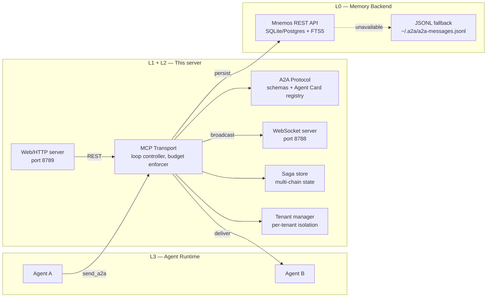

# Architecture

The system has four layers. `a2a-orchestrator` implements **L1** and
**L2**; L0 and L3 are external.



## Layers

| Layer | Responsibility | Implemented by |
| --- | --- | --- |
| **L0** Memory backend | Durable storage, full-text search | [Mnemos](https://github.com/Korrnals/mnemos) (external) |
| **L1** MCP transport | Loop controller, budget enforcer, logger, WS, web | **this server** |
| **L2** A2A protocol | JSON schemas, Agent Card registry, routing rules, sagas, signing, tenants | **this server** |
| **L3** Agent runtime | Agents that call `send_a2a` | your agents |

## Module layout

| Module | Role |
| --- | --- |
| `server.py` | FastMCP entry point, 11 MCP tools, persistence wiring |
| `routing.py` | R1–R4 gates + R6 signature check (pure functions, no I/O) |
| `destructive.py` | R5 consent provider |
| `registry.py` | Agent Card loader + whitelist forward index |
| `session.py` | Per-session chain/depth/budget state (LRU, thread-safe) |
| `validation.py` | JSON-schema validation for cards and messages |
| `mnemos_client.py` | Mnemos REST client with retry/backoff |
| `persistence.py` | In-memory + JSONL message store |
| `config.py` | Environment-based configuration + auto-detect |
| `saga.py` | Saga pattern — multi-chain dialog state, per-saga budget |
| `signing.py` | Ed25519 signed messages, canonical JSON, KeyStore |
| `search.py` | Vector/substring search with Mnemos→JSONL fallback |
| `ws_server.py` | WebSocket server for real-time event broadcast |
| `web_server.py` | FastAPI REST wrapper (optional `[web]` dependency) |
| `registration.py` | External agent registration with challenge-response |
| `tenant.py` | Multi-tenant isolation, TenantManager, TenantContext |
| `metrics.py` | Thread-safe counters for observability |
| `cli.py` | CLI wrapper (12 commands) |

## Data flow

A single `send_a2a` call traverses the full stack:

1. **L3** — Agent A calls `send_a2a` via MCP transport.
2. **L2** — Schema validation, then R1→R2→R3→R4→R6→R5 routing gates.
3. **L1** — Session chain/budget updated, saga tracked (if `saga_id`).
4. **L0** — Message persisted to Mnemos; JSONL fallback if Mnemos is down.
5. **L1** — WebSocket event broadcast; message delivered to Agent B.

Rejected messages are still persisted (with `outcome: "rejected"`) so
the audit trail is complete.

## Persistence and fallback

Every message — delivered or rejected — is persisted for audit. The
server tries Mnemos first; if Mnemos is unavailable, it falls back to
a local JSONL file.

```text
agent A → send_a2a → a2a-orchestrator
                        ├─[Mnemos OK]→ POST /v1/sessions/{id}/turns → 201 → deliver
                        └─[Mnemos DOWN]→ ~/.a2a/a2a-messages.jsonl → deliver
```

**Mnemos is not a single point of failure.** The orchestrator works
without it — messages are always written to the JSONL store first, then
mirrored to Mnemos.

## See also

- [Routing Rules](routing-rules.md) — the six gates in detail
- [Tools Reference](tools-reference.md) — the 11 MCP tools
- [Configuration](configuration.md) — env vars and auto-detection