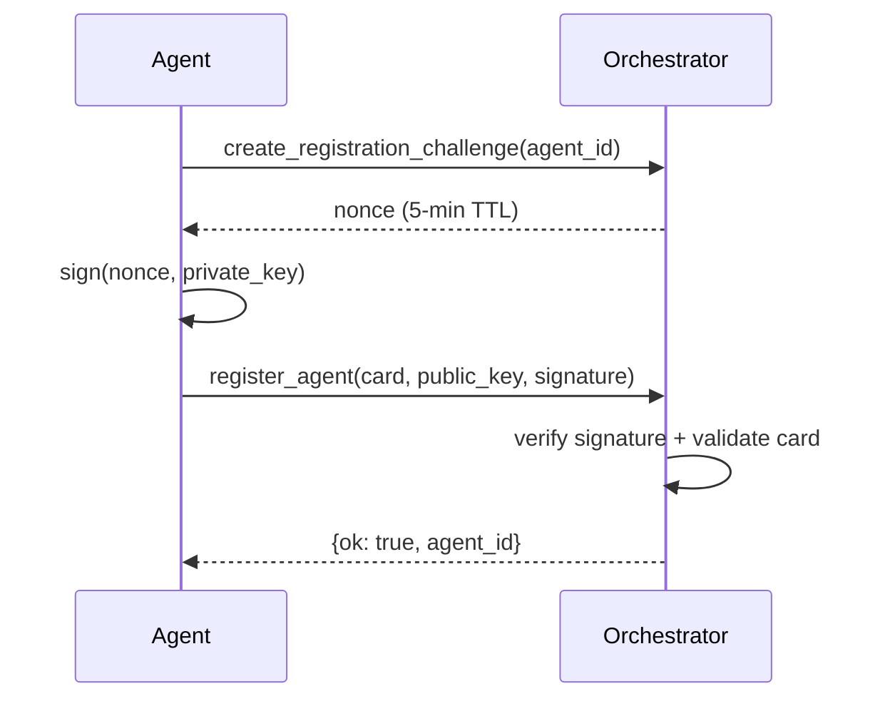

# External Agents

Agents outside the workspace can register at runtime by submitting
their Agent Card + public key, proving ownership of the corresponding
private key via a challenge-response signature.

## Registration flow



1. Agent calls `create_registration_challenge(agent_id)` → orchestrator
   generates a nonce, stores it with a 5-minute TTL.
2. Agent signs the nonce with their Ed25519 private key.
3. Agent calls `register_agent(agent_card, public_key,
   challenge_signature)`.
4. Orchestrator verifies the signature against the nonce, validates the
   Agent Card, and adds the card + key to the runtime registry +
   KeyStore.

## Step 1 — Request a challenge

```python
create_registration_challenge(agent_id="agent-external-1")
# → {ok: true, challenge: "<nonce>", reason: "created"}
```

## Step 2 — Sign the nonce

```python
import base64
from cryptography.hazmat.primitives.asymmetric.ed25519 import Ed25519PrivateKey

# Load your private key (generated beforehand)
private_key = Ed25519PrivateKey.from_private_bytes(raw_key_bytes)
signature = private_key.sign(nonce.encode("utf-8"))
sig_b64 = base64.b64encode(signature).decode()
```

## Step 3 — Register

```python
register_agent(
    agent_card=json.dumps({
        "id": "agent-external-1",
        "name": "External Agent",
        "version": "1.0.0",
        "plugin": "external",
        "agent_file": "external.agent.md",
        "capabilities": ["custom-task"],
        "routing": {
            "accepts_routes_from": ["agent-tech-lead"],
            "routing_keywords": ["custom"],
        },
    }),
    public_key=pub_key_b64,
    challenge_signature=sig_b64,
)
# → {ok: true, agent_id: "agent-external-1", reason: "registered"}
```

## Unregister

Remove an externally-registered agent:

```python
unregister_agent(agent_id="agent-external-1")
# → {ok: true, reason: "unregistered"}
```

## CLI

```bash
# Step 1: get the challenge nonce
a2a-cli register --agent-card card.json --public-key key.b64

# Step 2: sign the nonce and submit
a2a-cli register --agent-card card.json --public-key key.b64 --signature <sig>
```

## Per-tenant registration

Each tenant has its own `RegistrationService` bound to that tenant's
registry + key store. Pass `tenant_id` to scope registration:

```python
register_agent(
    agent_card=card_json,
    public_key=pub_key_b64,
    challenge_signature=sig_b64,
    tenant_id="acme-corp",
)
```

## See also

- [Signed Messages](signed-messages.md) — R6 and KeyStore
- [Multi-tenant](multi-tenant.md) — per-tenant isolation
- [Tools Reference](tools-reference.md) — registration tool signatures