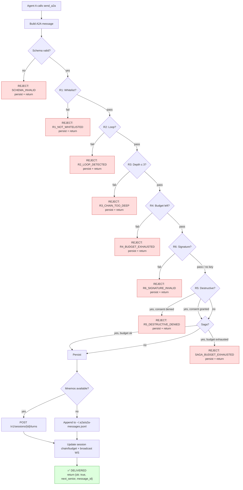

# Routing Rules (R1–R6)

Every `send_a2a` call passes through six gates in order. The first
gate that rejects stops the handoff.

## Rule table

| Rule | Name | Check | Rejection code |
| --- | --- | --- | --- |
| **R1** | Whitelist | Target must be in the sender's `accepts_routes_from` | `R1_NOT_WHITELISTED` |
| **R2** | Loop | Target must not already be upstream in the chain | `R2_LOOP_DETECTED` |
| **R3** | Depth | Chain depth ≤ 3 (configurable per-agent via `max_chain_depth`) | `R3_CHAIN_TOO_DEEP` |
| **R4** | Budget | Max 3 A2A calls per conversation | `R4_BUDGET_EXHAUSTED` |
| **R6** | Signature | If sender's Agent Card has `public_key`, message must be signed | `R6_SIGNATURE_INVALID` |
| **R5** | Destructive | User consent required for `destructive-action-request` intent | `R5_DESTRUCTIVE_DENIED` |

> **Order note.** The code applies R1→R2→R3→R4 (pure routing gates)
> first, then R6 (signature), then R5 (destructive consent). R5 is
> last because it may require interactive user consent.

## Routing pipeline

## Rule details

### R1 — Whitelist

The target must be reachable from the sender in the whitelist. The
registry builds a **forward index** from each card's
`accepts_routes_from`, so R1 checks are O(1).

A REJECT is returned if the sender is not registered, the target is
not registered, or the target is not in the sender's allowed set.

### R2 — Loop

The target must not already be upstream in the current chain. A loop
exists when the same A2A id appears twice in `session.chain`. The
sender is always in the chain (it sent the previous message) — its
presence is expected, not a loop.

### R3 — Depth

Chain depth must not exceed the limit. The global default is 3
(`MAX_CHAIN_DEPTH`). Each agent can override this via `max_chain_depth`
(range 1–5) in their Agent Card. The check enforces the **target's**
limit, not just the sender's.

### R4 — Budget

Maximum 3 A2A calls per conversation (`MAX_BUDGET`). Each `send_a2a`
decrements `calls_remaining`. When it hits zero, further calls are
rejected. A new `session_id` resets the budget.

### R6 — Signature

If the sender's Agent Card has a `public_key` field, the message must
be signed with the corresponding Ed25519 private key. If a key exists
but the signature is missing or invalid, the message is rejected with
`R6_SIGNATURE_INVALID`. See [Signed Messages](signed-messages.md).

### R5 — Destructive

The `destructive-action-request` intent requires explicit user consent.
The consent provider is fail-closed by default — VS Code UI integration
can monkey-patch it at runtime. See the `destructive.py` module.

## Error codes

| Code | Meaning |
| --- | --- |
| `SCHEMA_INVALID` | Message failed JSON-schema validation |
| `R1_NOT_WHITELISTED` | Sender not authorized to route to target |
| `R2_LOOP_DETECTED` | Target already upstream in the chain |
| `R3_CHAIN_TOO_DEEP` | Chain depth exceeded |
| `R4_BUDGET_EXHAUSTED` | Per-session call budget exhausted |
| `R6_SIGNATURE_INVALID` | Signature missing or invalid (R6) |
| `R5_DESTRUCTIVE_DENIED` | User denied consent for destructive action |
| `SAGA_NOT_FOUND` | `saga_id` does not exist |
| `SAGA_BUDGET_EXHAUSTED` | Per-saga call budget exhausted |

## See also

- [Tools Reference](tools-reference.md) — `send_a2a` signature
- [Signed Messages](signed-messages.md) — R6 in depth
- [Saga Pattern](saga-pattern.md) — saga budget enforcement