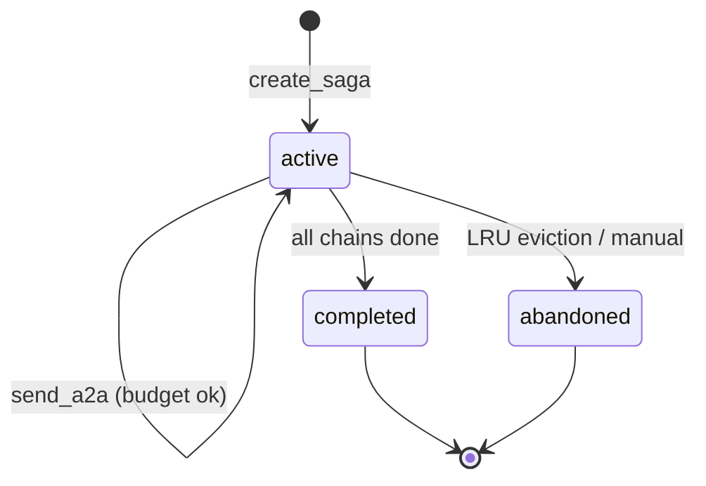

# Saga Pattern

A **saga** groups multiple A2A chains that belong to the same logical
task. Without sagas, each A2A message starts a fresh chain with
`depth=0`; with sagas, a multi-step task (where agent B asks agent A a
clarifying question mid-chain) can persist state across chain
boundaries.

## Properties

| Property | Value |
| --- | --- |
| Per-saga budget | 6 A2A calls (`SAGA_MAX_BUDGET = MAX_BUDGET × 2`) |
| States | `active`, `completed`, `abandoned` |
| LRU eviction | 128 sagas in memory |
| Thread-safe | yes (single `threading.Lock`) |

## Create a saga

Use the `create_saga` MCP tool:

```python
create_saga(
    root_session_id="conv-abc",
    metadata='{"task": "migrate-orders"}',
)
# → {ok: true, saga_id: "saga-1a2b3c4d5e6f", reason: "created"}
```

Or programmatically via the internal API:

```python
from a2a_orchestrator.server import saga_store

saga = saga_store.create_saga(
    root_session_id="conv-abc",
    metadata={"task": "migrate-orders"},
)
# saga.saga_id → "saga-<hex>"
```

## Use a saga in `send_a2a`

Pass `saga_id` to track the chain within the saga. The per-saga budget
is enforced **in addition to** the per-session budget.

```python
send_a2a(
    target="agent-dba",
    reason="Need schema review for migration",
    summary="Orders table migration plan",
    saga_id="saga-1a2b3c4d5e6f",
    from_id="agent-tech-lead",
    session_id="conv-abc",
)
```

If the saga budget is exhausted, the message is rejected with
`SAGA_BUDGET_EXHAUSTED`. If the `saga_id` does not exist, the rejection
code is `SAGA_NOT_FOUND`.

## Inspect saga state

Use the `get_saga_status` MCP tool:

```python
get_saga_status(saga_id="saga-1a2b3c4d5e6f")
# → {ok: true, saga: {saga_id, state, chains, budget_used, ...}}
```

Or via CLI:

```bash
a2a-cli saga status saga-1a2b3c4d5e6f
a2a-cli saga list --status active
```

## Saga states



| State | Meaning |
| --- | --- |
| `active` | Saga is accepting new A2A calls |
| `completed` | All chains finished successfully |
| `abandoned` | Saga evicted from memory or manually abandoned |

## See also

- [Tools Reference](tools-reference.md) — `create_saga`, `get_saga_status`
- [Routing Rules](routing-rules.md) — `SAGA_BUDGET_EXHAUSTED` code
- [CLI Reference](cli-reference.md) — `saga list`, `saga status`