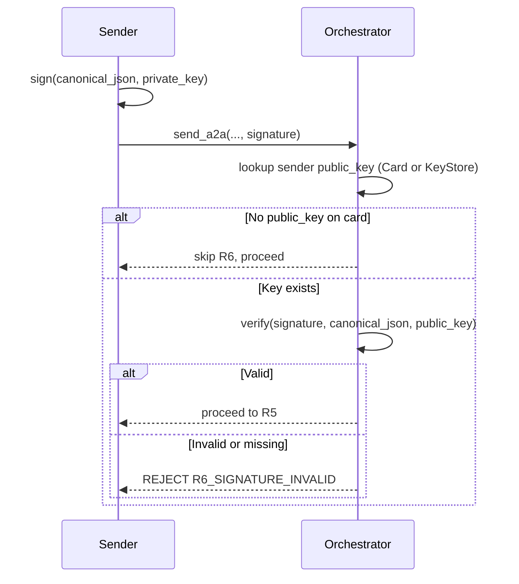

# Signed Messages (R6)

When agents are distributed (not all in the same trusted workspace),
messages need cryptographic verification. Each agent has an Ed25519
keypair. Messages are signed by the sender; the orchestrator verifies
the signature against the sender's public key.

## Backward compatibility

If the sender's Agent Card has **no** `public_key` field, signature
verification is skipped entirely (trust-by-construction, as before).
Signing is opt-in per agent.

## How it works

1. The sender signs the **canonical JSON** of the message (sorted
   keys, no whitespace, UTF-8 preserved) with their Ed25519 private key.
2. The signature is passed as `signature` (base64) to `send_a2a`.
3. R6 checks the sender's `public_key` (Agent Card or KeyStore). If a
   key exists but the signature is missing or invalid, the message is
   rejected with `R6_SIGNATURE_INVALID`.

## Key sources

| Source | When |
| --- | --- |
| Agent Card `public_key` field | File-based agents loaded at startup |
| Runtime `KeyStore` | Externally-registered agents (see [External Agents](external-agents.md)) |

## Generating a keypair

```python
from cryptography.hazmat.primitives.asymmetric.ed25519 import Ed25519PrivateKey
import base64

private_key = Ed25519PrivateKey.generate()
public_key_bytes = private_key.public_key().public_bytes_raw()
# Store in Agent Card:
#   "public_key": base64.b64encode(public_key_bytes).decode()
```

## Signing a message

```python
import json
from cryptography.hazmat.primitives.asymmetric.ed25519 import Ed25519PrivateKey
import base64

# Canonical JSON: sorted keys, no extra whitespace, UTF-8 preserved
canonical = json.dumps(message, sort_keys=True, ensure_ascii=False, separators=(",", ":"))
signature = private_key.sign(canonical.encode("utf-8"))
sig_b64 = base64.b64encode(signature).decode()

send_a2a(
    target="agent-dba",
    reason="...",
    summary="...",
    from_id="agent-tech-lead",
    signature=sig_b64,
)
```

## Verification flow



## KeyStore (runtime keys)

The `KeyStore` holds public keys for externally-registered agents.
When an agent registers via `register_agent`, their public key is
stored in the tenant's `KeyStore`. R6 checks the KeyStore if the
sender is not in the file-based registry.

## See also

- [Routing Rules](routing-rules.md) — R6 in the pipeline
- [External Agents](external-agents.md) — registration with Ed25519
- [Security](security.md) — threat model and hardening