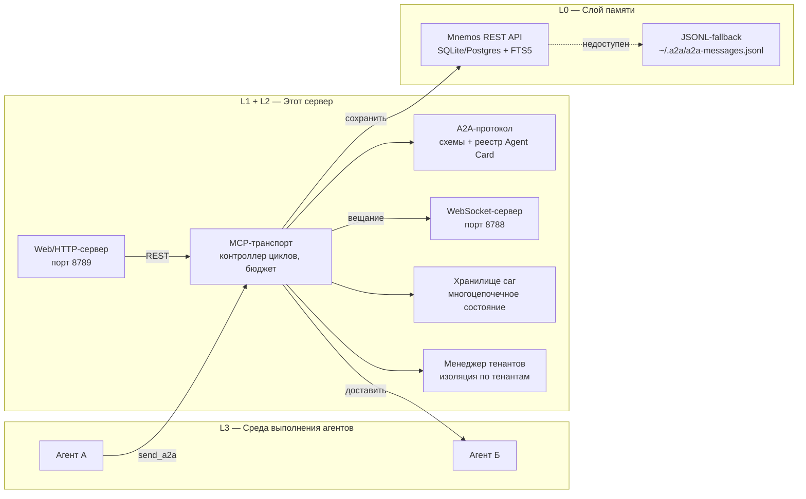

# Архитектура

Система состоит из четырёх слоёв. `a2a-orchestrator` реализует **L1** и
**L2**; L0 и L3 — внешние.



## Слои

| Слой | Ответственность | Реализован |
| --- | --- | --- |
| **L0** Слой памяти | Долговременное хранение, полнотекстовый поиск | [Mnemos](https://github.com/Korrnals/mnemos) (внешний) |
| **L1** MCP-транспорт | Контроллер циклов, бюджет, логирование, WS, web | **этим сервером** |
| **L2** A2A-протокол | JSON-схемы, реестр Agent Card, правила маршрутизации, саги, подписи, тенанты | **этим сервером** |
| **L3** Среда выполнения | Агенты, вызывающие `send_a2a` | ваши агенты |

## Структура модулей

| Модуль | Роль |
| --- | --- |
| `server.py` | Точка входа FastMCP, 11 MCP-инструментов, связывание сохранения |
| `routing.py` | Ворота R1–R4 + проверка подписи R6 (чистые функции, без I/O) |
| `destructive.py` | Провайдер согласия R5 |
| `registry.py` | Загрузчик Agent Card + прямой индекс белого списка |
| `session.py` | Состояние цепочки/глубины/бюджета сессии (LRU, потокобезопасно) |
| `validation.py` | Валидация по JSON-схеме для карточек и сообщений |
| `mnemos_client.py` | Mnemos REST-клиент с повторами и backoff |
| `persistence.py` | Хранилище сообщений в памяти + JSONL |
| `config.py` | Конфигурация через окружение + автоопределение |
| `saga.py` | Паттерн «сага» — многоцепочечное состояние, бюджет на сагу |
| `signing.py` | Подписанные сообщения Ed25519, канонический JSON, KeyStore |
| `search.py` | Векторный/подстрочный поиск с fallback Mnemos→JSONL |
| `ws_server.py` | WebSocket-сервер для вещания событий в реальном времени |
| `web_server.py` | REST-обёртка FastAPI (опциональная зависимость `[web]`) |
| `registration.py` | Регистрация внешних агентов с challenge-response |
| `tenant.py` | Мультитенантная изоляция, TenantManager, TenantContext |
| `metrics.py` | Потокобезопасные счётчики для наблюдаемости |
| `cli.py` | CLI-обёртка (12 команд) |

## Поток данных

Один вызов `send_a2a` проходит весь стек:

1. **L3** — Агент А вызывает `send_a2a` через MCP-транспорт.
2. **L2** — Валидация схемы, затем ворота R1→R2→R3→R4→R6→R5.
3. **L1** — Обновление цепочки/бюджета сессии, отслеживание саги.
4. **L0** — Сохранение в Mnemos; JSONL-fallback при недоступности.
5. **L1** — Вещание WebSocket-события; доставка агенту Б.

Отклонённые сообщения всё равно сохраняются (с `outcome: "rejected"`),
поэтому аудит-след остаётся полным.

## Сохранение и fallback

Каждое сообщение — доставленное или отклонённое — сохраняется для аудита.
Сервер сначала пробует Mnemos; если недоступен — переключается на
локальный JSONL-файл.

```text
агент А → send_a2a → a2a-orchestrator
                        ├─[Mnemos OK]→ POST /v1/sessions/{id}/turns → 201 → доставить
                        └─[Mnemos DOWN]→ ~/.a2a/a2a-messages.jsonl → доставить
```

**Mnemos не является единой точкой отказа.** Оркестратор работает без
него — сообщения всегда сначала пишутся в JSONL, а затем дублируются
в Mnemos.

## См. также

- [Правила маршрутизации](routing-rules.md) — шесть ворот подробно
- [Справочник инструментов](tools-reference.md) — 11 MCP-инструментов
- [Конфигурация](configuration.md) — переменные окружения и автоопределение