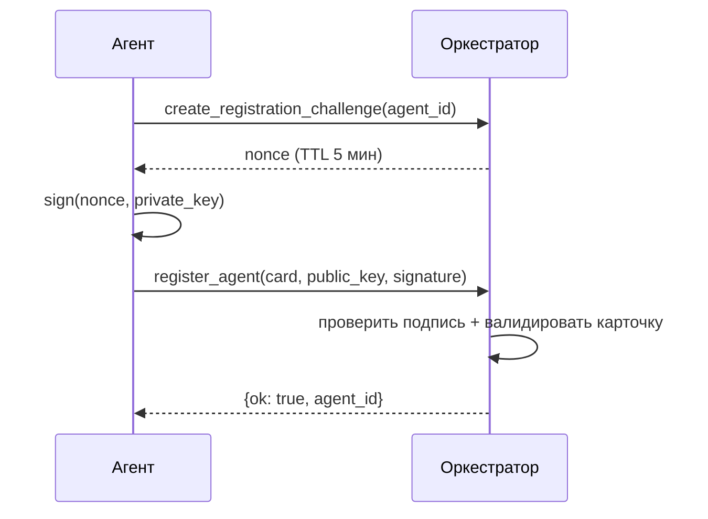

# Внешние агенты

Агенты вне workspace могут регистрироваться в рантайме, отправляя свою
Agent Card + открытый ключ и доказывая владение соответствующим закрытым
ключом через challenge-response подпись.

## Поток регистрации



1. Агент вызывает `create_registration_challenge(agent_id)` →
   оркестратор генерирует nonce, хранит его с TTL 5 минут.
2. Агент подписывает nonce своим закрытым ключом Ed25519.
3. Агент вызывает `register_agent(agent_card, public_key,
   challenge_signature)`.
4. Оркестратор проверяет подпись по nonce, валидирует Agent Card и
   добавляет карточку + ключ в рантайм-реестр + KeyStore.

## Шаг 1 — Запрос challenge

```python
create_registration_challenge(agent_id="agent-external-1")
# → {ok: true, challenge: "<nonce>", reason: "created"}
```

## Шаг 2 — Подпись nonce

```python
import base64
from cryptography.hazmat.primitives.asymmetric.ed25519 import Ed25519PrivateKey

# Загрузите свой закрытый ключ (сгенерированный заранее)
private_key = Ed25519PrivateKey.from_private_bytes(raw_key_bytes)
signature = private_key.sign(nonce.encode("utf-8"))
sig_b64 = base64.b64encode(signature).decode()
```

## Шаг 3 — Регистрация

```python
register_agent(
    agent_card=json.dumps({
        "id": "agent-external-1",
        "name": "External Agent",
        "version": "1.0.0",
        "plugin": "external",
        "agent_file": "external.agent.md",
        "capabilities": ["custom-task"],
        "routing": {
            "accepts_routes_from": ["agent-tech-lead"],
            "routing_keywords": ["custom"],
        },
    }),
    public_key=pub_key_b64,
    challenge_signature=sig_b64,
)
# → {ok: true, agent_id: "agent-external-1", reason: "registered"}
```

## Удаление

Удалить внешнего зарегистрированного агента:

```python
unregister_agent(agent_id="agent-external-1")
# → {ok: true, reason: "unregistered"}
```

## CLI

```bash
# Шаг 1: получить challenge-nonce
a2a-orchestrator register --agent-card card.json --public-key key.b64

# Шаг 2: подписать nonce и отправить
a2a-orchestrator register --agent-card card.json --public-key key.b64 --signature <sig>
```

## Регистрация по тенантам

У каждого тенанта свой `RegistrationService`, привязанный к реестру и
хранилищу ключей этого тенанта. Передайте `tenant_id` для регистрации в
конкретном тенанте:

```python
register_agent(
    agent_card=card_json,
    public_key=pub_key_b64,
    challenge_signature=sig_b64,
    tenant_id="acme-corp",
)
```

## См. также

- [Подписанные сообщения](signed-messages.md) — R6 и KeyStore
- [Мультитенантность](multi-tenant.md) — изоляция по тенантам
- [Справочник инструментов](tools-reference.md) — сигнатуры инструментов регистрации