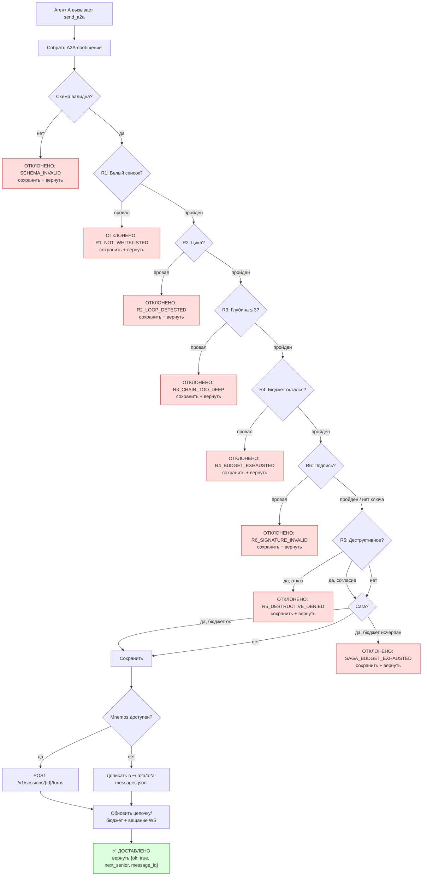

# Правила маршрутизации (R1–R6)

Каждый вызов `send_a2a` проходит шесть ворот по порядку. Первый ворот,
который отклоняет, останавливает передачу.

## Таблица правил

| Правило | Название | Проверка | Код отклонения |
| --- | --- | --- | --- |
| **R1** | Белый список | Цель должна быть в `accepts_routes_from` отправителя | `R1_NOT_WHITELISTED` |
| **R2** | Цикл | Цель не должна уже быть выше по цепочке | `R2_LOOP_DETECTED` |
| **R3** | Глубина | Глубина цепочки ≤ 3 (настраивается через `max_chain_depth`) | `R3_CHAIN_TOO_DEEP` |
| **R4** | Бюджет | Максимум 3 A2A-вызова на разговор | `R4_BUDGET_EXHAUSTED` |
| **R6** | Подпись | Если в Agent Card отправителя есть `public_key`, сообщение должно быть подписано | `R6_SIGNATURE_INVALID` |
| **R5** | Деструктивное | Согласие пользователя для интента `destructive-action-request` | `R5_DESTRUCTIVE_DENIED` |

> **Порядок.** Код применяет R1→R2→R3→R4 (чистые routing-ворота)
> сначала, затем R6 (подпись), затем R5 (деструктивное согласие). R5
> последний, потому что может требовать интерактивного согласия
> пользователя.

## Конвейер маршрутизации

## Детали правил

### R1 — Белый список

Цель должна быть достижима из отправителя по белому списку. Реестр
строит **прямой индекс** из `accepts_routes_from` каждой карточки,
поэтому проверка R1 выполняется за O(1).

Отклонение возвращается, если отправитель не зарегистрирован, цель не
зарегистрирована или цель не входит в разрешённый набор отправителя.

### R2 — Цикл

Цель не должна уже быть выше по цепочке. Цикл существует, когда один и
тот же A2A-id встречается дважды в `session.chain`. Отправитель всегда
в цепочке (он отправил предыдущее сообщение) — его наличие ожидаемо,
не является циклом.

### R3 — Глубина

Глубина цепочки не должна превышать лимит. Глобальный максимум — 3
(`MAX_CHAIN_DEPTH`). Каждый агент может переопределить это через
`max_chain_depth` (диапазон 1–5) в своей Agent Card. Проверяется лимит
**цели**, а не только отправителя.

### R4 — Бюджет

Максимум 3 A2A-вызова на разговор (`MAX_BUDGET`). Каждый `send_a2a`
уменьшает `calls_remaining`. При достижении нуля дальнейшие вызовы
отклоняются. Новый `session_id` сбрасывает бюджет.

### R6 — Подпись

Если в Agent Card отправителя есть поле `public_key`, сообщение должно
быть подписано соответствующим закрытым ключом Ed25519. Если ключ есть,
а подпись отсутствует или недействительна, сообщение отклоняется с
`R6_SIGNATURE_INVALID`. См. [Подписанные сообщения](signed-messages.md).

### R5 — Деструктивное

Интент `destructive-action-request` требует явного согласия
пользователя. Провайдер согласия по умолчанию fail-closed — интеграция
VS Code UI может подменить его в рантайме. См. модуль `destructive.py`.

## Коды ошибок

| Код | Значение |
| --- | --- |
| `SCHEMA_INVALID` | Сообщение не прошло валидацию JSON-схемы |
| `R1_NOT_WHITELISTED` | Отправитель не авторизован маршрутизировать к цели |
| `R2_LOOP_DETECTED` | Цель уже выше по цепочке |
| `R3_CHAIN_TOO_DEEP` | Превышена глубина цепочки |
| `R4_BUDGET_EXHAUSTED` | Бюджет вызовов сессии исчерпан |
| `R6_SIGNATURE_INVALID` | Подпись отсутствует или недействительна (R6) |
| `R5_DESTRUCTIVE_DENIED` | Пользователь отказал в согласии на деструктивное действие |
| `SAGA_NOT_FOUND` | `saga_id` не существует |
| `SAGA_BUDGET_EXHAUSTED` | Бюджет вызовов саги исчерпан |

## См. также

- [Справочник инструментов](tools-reference.md) — сигнатура `send_a2a`
- [Подписанные сообщения](signed-messages.md) — R6 подробно
- [Паттерн «сага»](saga-pattern.md) — контроль бюджета саги