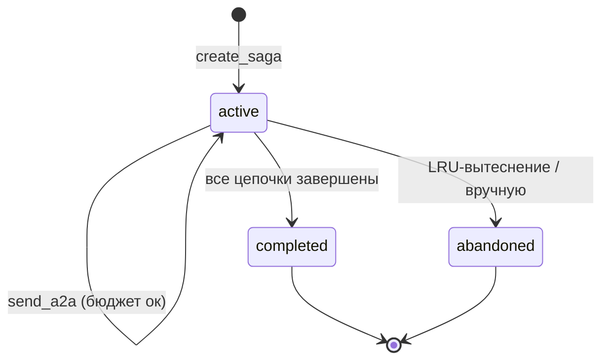

# Паттерн «сага»

**Сага** группирует несколько A2A-цепочек, принадлежащих одной
логической задаче. Без саг каждое A2A-сообщение начинает новую цепочку
с `depth=0`; с сагами многошаговая задача (где агент Б посреди цепочки
задаёт агенту А уточняющий вопрос) может сохранять состояние через
границы цепочек.

## Свойства

| Свойство | Значение |
| --- | --- |
| Бюджет на сагу | 6 A2A-вызовов (`SAGA_MAX_BUDGET = MAX_BUDGET × 2`) |
| Состояния | `active`, `completed`, `abandoned` |
| LRU-вытеснение | 128 саг в памяти |
| Потокобезопасно | да (один `threading.Lock`) |

## Создание саги

Используйте MCP-инструмент `create_saga`:

```python
create_saga(
    root_session_id="conv-abc",
    metadata='{"task": "migrate-orders"}',
)
# → {ok: true, saga_id: "saga-1a2b3c4d5e6f", reason: "created"}
```

Или программно через внутренний API:

```python
from a2a_orchestrator.server import saga_store

saga = saga_store.create_saga(
    root_session_id="conv-abc",
    metadata={"task": "migrate-orders"},
)
# saga.saga_id → "saga-<hex>"
```

## Использование саги в `send_a2a`

Передайте `saga_id`, чтобы отслеживать цепочку внутри саги. Бюджет саги
учитывается **дополнительно** к бюджету сессии.

```python
send_a2a(
    target="agent-dba",
    reason="Нужно ревью схемы для миграции",
    summary="План миграции таблицы orders",
    saga_id="saga-1a2b3c4d5e6f",
    from_id="agent-tech-lead",
    session_id="conv-abc",
)
```

Если бюджет саги исчерпан, сообщение отклоняется с
`SAGA_BUDGET_EXHAUSTED`. Если `saga_id` не существует — код отклонения
`SAGA_NOT_FOUND`.

## Инспекция состояния саги

Используйте MCP-инструмент `get_saga_status`:

```python
get_saga_status(saga_id="saga-1a2b3c4d5e6f")
# → {ok: true, saga: {saga_id, state, chains, budget_used, ...}}
```

Или через CLI:

```bash
a2a-cli saga status saga-1a2b3c4d5e6f
a2a-cli saga list --status active
```

## Состояния саги



| Состояние | Значение |
| --- | --- |
| `active` | Сага принимает новые A2A-вызовы |
| `completed` | Все цепочки успешно завершены |
| `abandoned` | Сага вытеснена из памяти или покинута вручную |

## См. также

- [Справочник инструментов](tools-reference.md) — `create_saga`, `get_saga_status`
- [Правила маршрутизации](routing-rules.md) — код `SAGA_BUDGET_EXHAUSTED`
- [Справочник CLI](cli-reference.md) — `saga list`, `saga status`