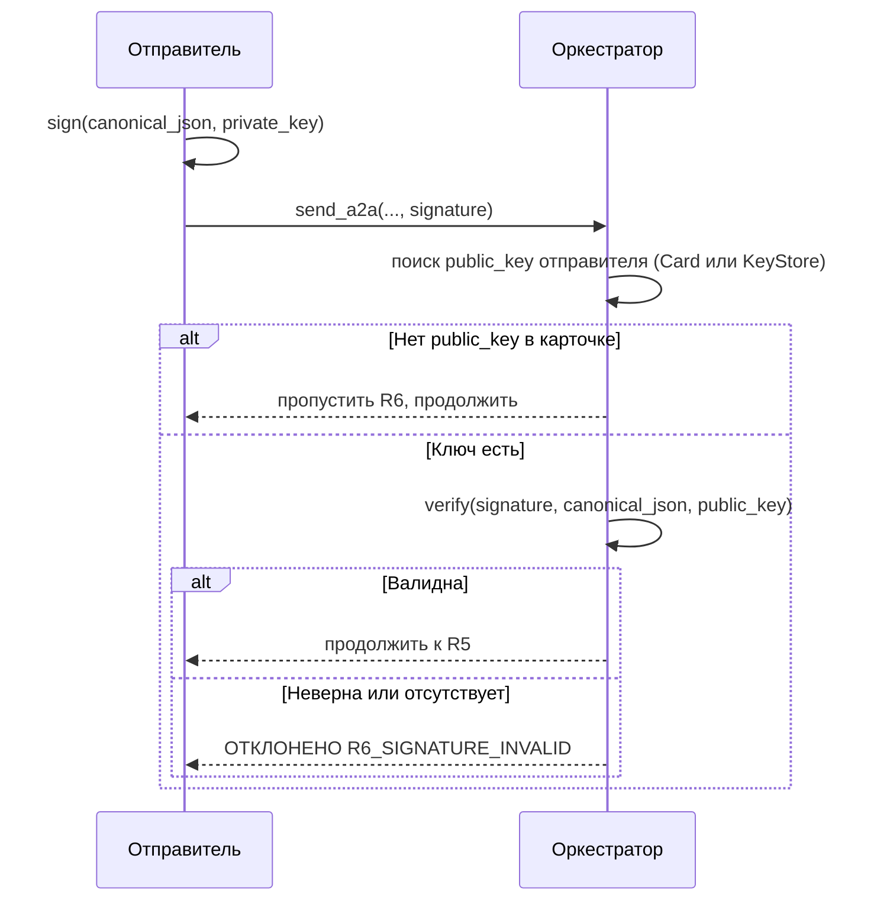

# Подписанные сообщения (R6)

Когда агенты распределены (не все в одном доверенном workspace),
сообщениям нужна криптографическая проверка. У каждого агента есть
ключевая пара Ed25519. Сообщения подписываются отправителем;
оркестратор проверяет подпись по открытому ключу отправителя.

## Обратная совместимость

Если в Agent Card отправителя **нет** поля `public_key`, проверка
подписи полностью пропускается (trust-by-construction, как раньше).
Подписывание опционально для каждого агента.

## Как это работает

1. Отправитель подписывает **канонический JSON** сообщения
   (сортированные ключи, без лишних пробелов, UTF-8 сохранён) своим
   закрытым ключом Ed25519.
2. Подпись передаётся как `signature` (base64) в `send_a2a`.
3. R6 проверяет `public_key` отправителя (Agent Card или KeyStore).
   Если ключ есть, а подпись отсутствует или недействительна,
   сообщение отклоняется с `R6_SIGNATURE_INVALID`.

## Источники ключей

| Источник | Когда |
| --- | --- |
| Поле `public_key` в Agent Card | Файловые агенты, загруженные при старте |
| Рантайм-`KeyStore` | Внешние зарегистрированные агенты (см. [Внешние агенты](external-agents.md)) |

## Генерация ключевой пары

```python
from cryptography.hazmat.primitives.asymmetric.ed25519 import Ed25519PrivateKey
import base64

private_key = Ed25519PrivateKey.generate()
public_key_bytes = private_key.public_key().public_bytes_raw()
# Записать в Agent Card:
#   "public_key": base64.b64encode(public_key_bytes).decode()
```

## Подпись сообщения

```python
import json
from cryptography.hazmat.primitives.asymmetric.ed25519 import Ed25519PrivateKey
import base64

# Канонический JSON: сортированные ключи, без лишних пробелов, UTF-8 сохранён
canonical = json.dumps(message, sort_keys=True, ensure_ascii=False, separators=(",", ":"))
signature = private_key.sign(canonical.encode("utf-8"))
sig_b64 = base64.b64encode(signature).decode()

send_a2a(
    target="agent-dba",
    reason="...",
    summary="...",
    from_id="agent-tech-lead",
    signature=sig_b64,
)
```

## Поток проверки



## KeyStore (рантайм-ключи)

`KeyStore` хранит открытые ключи внешних зарегистрированных агентов.
При регистрации через `register_agent` открытый ключ сохраняется в
`KeyStore` тенанта. R6 проверяет KeyStore, если отправителя нет в
файловом реестре.

## См. также

- [Правила маршрутизации](routing-rules.md) — R6 в конвейере
- [Внешние агенты](external-agents.md) — регистрация с Ed25519
- [Безопасность](security.md) — threat model и усиление